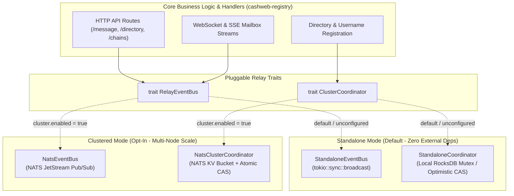

# 🏛️ Track C: Clustered Relay Architecture & Dual-Mode Execution Specification

**Status**: Architecture Standard & Scoping Specification  
**Parent Epic**: #821  
**Related Issues**: #981, #982, #983, #971, #974  
**Primary Invariant**: **Zero-overhead, zero-external-dependency standalone operation MUST remain the default.** Laypeople, single-node self-hosters, CI runners, and unit/integration tests must never be forced to run NATS, Redis, or external consensus services.

---

## 1. Executive Summary & Design Principles

The Frank Cashweb relay daemon (`cashwebd` / `cashweb-registry`) is designed to scale horizontally across multi-region server clusters without sacrificing the ease of self-hosting for individual users.

To achieve both goals simultaneously, the architecture enforces a strict **Dual-Mode Abstraction Layer**:

| Mode                          | Target Audience                                    | External Dependencies                   | Storage & Pub/Sub Mechanism                                           |
| ----------------------------- | -------------------------------------------------- | --------------------------------------- | --------------------------------------------------------------------- |
| **Standalone Mode (Default)** | Laypeople, home labs, developers, CI/unit tests    | **None** (single binary)                | Embedded RocksDB + in-memory `tokio::sync::broadcast` channels        |
| **Clustered Mode (Opt-In)**   | Multi-node deployments, high-availability clusters | NATS JetStream (or external Raft/Redis) | Distributed NATS KV for CAS + JetStream pub/sub for cross-node fanout |

---

## 2. Dual-Mode Abstraction Architecture

All HTTP handlers, WebSocket session dispatchers, and directory controllers interact **exclusively** with unified Rust traits. Neither domain logic nor API handlers ever know whether the underlying driver is standalone or clustered.



---

## 3. Configuration & Runtime Selection

Configuration lives in `cashweb-config` (`RegistryConf`).

### 3.1 Default Standalone Configuration (`frank.toml`)

For a layperson or self-hoster, the `[cluster]` section is omitted entirely. No cluster configuration is required:

```toml
# Default single-node setup for laypeople & self-hosters
[registry]
db_path = "/var/lib/frank/db"
bind_addr = "0.0.0.0:443"
```

_Result_: `cashwebd` starts immediately, spawns in-process broadcast buses, opens local RocksDB, and serves traffic with zero networking friction.

### 3.2 Clustered Configuration (`frank.toml`)

For multi-node deployments behind a load balancer:

```toml
# Multi-node clustered deployment
[registry]
db_path = "/var/lib/frank/db"
bind_addr = "0.0.0.0:443"

[registry.cluster]
enabled = true
driver = "nats"
nats_url = "nats://nats-cluster:4222"
cluster_name = "frank-prod-us"
node_id = "relay-node-01"
```

Environment variable overrides:

- `FRANK_CLUSTER_ENABLED=true`
- `FRANK_CLUSTER_NATS_URL=nats://...`
- `FRANK_CLUSTER_NODE_ID=relay-01`

---

## 4. Full Scoping for Track C Issues

### 4.1 Issue #981: Cluster-wide Username Uniqueness & Tombstones

- **Objective**: Prevent two users from concurrently claiming the same username on two separate cluster nodes.
- **Standalone Mode Behavior**:
  - Validates handle syntax (`^[a-z0-9][a-z0-9_-]{2,31}$`).
  - Executes atomic check-and-insert directly in RocksDB `usernames` column family using a single RocksDB write batch.
  - If already exists: checks if tombstone cooling period has elapsed. If active, returns `HTTP 409 Conflict`.
- **Clustered Mode Behavior**:
  - Leverages NATS KV bucket `frank-usernames` initialized with Raft consensus.
  - Executes `kv.create(username, statement_bytes)` using atomic revision creation.
  - If another node registered the key simultaneously, NATS returns revision collision error (`10071`), which `cashwebd` maps cleanly to `HTTP 409 Conflict`.
  - On successful CAS, writes to local RocksDB cache for instant reads.
- **Testing Invariant**:
  - Integration test suite MUST run in Standalone mode during standard CI (`cargo test`).
  - Clustered integration tests run against an ephemeral testcontainers NATS instance in an optional integration test lane.

### 4.2 Issue #982: Real-time Message & Event Distribution

- **Objective**: When a message arrives at Node A, ensure Node B (where the recipient has an active WebSocket/SSE sync connection) immediately receives the event and pushes it to the recipient's browser.
- **Standalone Mode Behavior**:
  - Upon message arrival and validation, publishes event to an in-memory `tokio::sync::broadcast::Sender`.
  - Connected WebSockets on the same process receive the message event and stream it out.
- **Clustered Mode Behavior**:
  - Publishes encrypted payload arrival to NATS JetStream subject:
    `frank.relay.mailbox.<recipient_account_address_hex>`
  - Every cluster node subscribes to mailbox subjects matching its currently connected WebSocket sessions.
  - When Node A accepts an HTTP PUT delivery, Node B's subscriber triggers instantly and pushes to the client socket without polling.
  - Preserves the **Content-Oblivious Boundary**: Subject contains only the recipient address hex; message content remains end-to-end encrypted.

### 4.3 Issue #983: Clustered Email Gateway Multi-Worker Pool

- **Objective**: Scale `packages/email-gateway` horizontally across multiple worker servers to handle high-volume inbound SMTP (port 25) without duplicate deliveries or lost messages.
- **Standalone Mode Behavior**:
  - Uses local embedded SQLite database for queue spooling and retry tracking (`spool.db`).
  - In-process worker thread periodically sweeps and retries failed deliveries.
- **Clustered Mode Behavior**:
  - Migrates queue spool to NATS JetStream WorkQueue stream `mail-inbound-work`.
  - Multiple worker nodes process incoming emails concurrently. Each worker takes a message with an explicit acknowledgment timeout (`ack_wait: 30s`).
  - If a worker crashes mid-delivery, NATS re-delivers the message to a healthy worker automatically.
  - Avoids double-spending of DKSAP payments through idempotent message transaction deduplication.

---

## 5. Security & Failure Invariants

1. **Fail-Closed on Consensus Loss**:
   - If a clustered relay loses connectivity to the NATS cluster, it MUST fail-closed on new registrations and username claims (returning `HTTP 503 Service Unavailable`), preventing split-brain double-claims.
   - Mailbox reads of already-persisted local data MAY continue serving in read-only mode.
2. **Zero Cryptographic Compromise**:
   - The cluster bus never carries unencrypted private key material.
   - Cluster messaging subjects convey only public cryptographic addresses and encrypted CBOR byte vectors.
3. **Graceful Single-Binary Degradation**:
   - If `[registry.cluster]` is absent or `enabled = false`, `cashwebd` compiles and runs as a completely self-contained binary without initializing any network sockets or client libraries for NATS.
