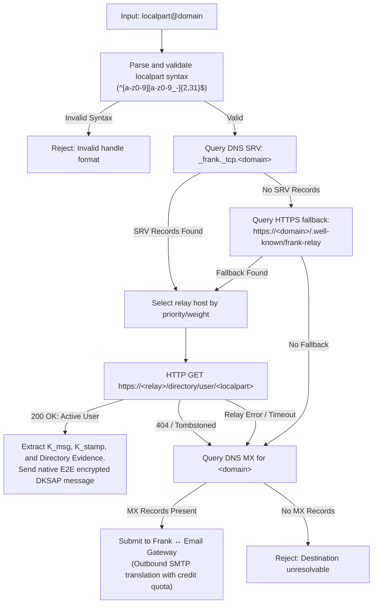

# Frank Dual-Protocol Domain DNS Routing Specification (SRV + MX)

- **Status**: Standard Draft (Parent Epic #821, Issue #973)
- **Scope**: DNS standards and client resolution algorithms enabling `user@domain` handles to function simultaneously as native Frank cryptographic direct-message endpoints and standard RFC 5321/5322 email addresses.

---

## 1. Overview & Architectural Objective

Frank provides self-custodial, end-to-end encrypted messaging with Dual-Key Stealth Address Protocol (DKSAP) financial payments. In traditional communication networks, users must manage disparate identifiers: public cryptographic keys, telephone numbers, and email addresses.

This specification establishes DNS record conventions and client resolution procedures allowing any registered Internet domain (e.g., `alice@example.com`) to serve as:

1. **A Native Frank Direct Messaging Handle**: Resolving transparently to a federated Cashweb relay endpoint, retrieving the recipient's authenticated Diffie-Hellman encryption public key ($K_{\text{msg}}$), stamp payment key ($K_{\text{stamp}}$), and directory evidence.
2. **A Standard Internet Email Address**: Routing traditional SMTP mail delivery through MX records to an automated Frank Email Gateway daemon that translates inbound emails into privacy-preserving DKSAP direct messages.

---

## 2. DNS Record Specifications

### 2.1 Native Frank Relay Discovery via DNS SRV (RFC 2782)

Domains supporting native Frank messaging MUST publish one or more DNS SRV records under the `_frank._tcp` service label.

#### Record Syntax

```text
_frank._tcp.<domain>. <ttl> IN SRV <priority> <weight> <port> <target>.
```

- **Service**: `_frank` (symbolic name for Frank federated Cashweb messaging protocol).
- **Proto**: `_tcp` (transport protocol).
- **Domain**: The target apex or sub-domain name containing the handle.
- **Priority**: Unsigned 16-bit integer (lowest value is prioritized; typically `10`).
- **Weight**: Unsigned 16-bit integer for server selection load-balancing when priorities match.
- **Port**: TCP port number hosting the Cashweb relay HTTPS service (MUST be `443` for standard production deployments).
- **Target**: Canonical fully-qualified domain name (FQDN) of the Cashweb relay host.

#### Example

```dns
; Primary and secondary federated Frank relays for example.com
_frank._tcp.example.com. 3600 IN SRV 10 50 443 relay1.example.com.
_frank._tcp.example.com. 3600 IN SRV 10 50 443 relay2.example.com.
_frank._tcp.example.com. 3600 IN SRV 20  0 443 backup-relay.example.com.
```

### 2.2 HTTPS Well-Known Fallback Endpoint (RFC 8615)

If a DNS SRV query yields `NXDOMAIN` or no records, Frank clients MUST query the RFC 8615 well-known URI fallback:

```text
GET https://<domain>/.well-known/frank-relay
Accept: application/json
```

The well-known configuration document returns:

```json
{
  "version": 1,
  "relays": [
    {
      "endpoint": "https://relay1.example.com",
      "priority": 10
    }
  ]
}
```

### 2.3 Email Inbound Routing via DNS MX (RFC 5321)

To support legacy SMTP clients and bidirectional email interoperation, the domain publishes standard MX records pointing to the Frank Email Gateway daemon.

#### Example

```dns
; Traditional SMTP inbound delivery to Frank Email Gateway
example.com. 3600 IN MX 10 mail.example.com.

; Email authentication records (SPF, DKIM, DMARC)
example.com. 3600 IN TXT "v=spf1 mx ip4:198.51.100.25 -all"
_dmarc.example.com. 3600 IN TXT "v=DMARC1; p=quarantine; rua=mailto:dmarc@example.com"
frank._domainkey.example.com. 3600 IN TXT "v=DKIM1; k=ed25519; p=MIGfMA0GCSqGSIb3DQEBAQUAA4GNADCBiQ..."
```

---

## 3. Client Handle Resolution Algorithm

When a Frank client or daemon is instructed to communicate with an identifier matching `localpart@domain`:



### 3.1 Resolution Step-by-Step

1. **Syntax Validation**:

   - The client splits the string at `@`.
   - `localpart` MUST match `^[a-z0-9][a-z0-9_-]{2,31}$` (lowercase ASCII alphanumeric, hyphens, and underscores; 3 to 32 characters; starting with alphanumeric).
   - `domain` MUST conform to standard FQDN hostname syntax (RFC 1123).

2. **Native Frank Relay Resolution**:

   - Resolve SRV records for `_frank._tcp.<domain>`.
   - Sort candidate relays by ascending `priority`, distributing traffic across equal priorities according to `weight`.
   - If SRV resolution fails, fetch `https://<domain>/.well-known/frank-relay`.

3. **Directory Verification**:

   - Connect via TLS 1.3 to `https://<relay_fqdn>:<port>/directory/user/<localpart>`.
   - Expect JSON response:
     ```json
     {
       "username": "alice",
       "status": "active",
       "account": "0x7484023b108dbd1620c7dd17b7ce6d5789d519a9",
       "messaging_pubkey": "02c6047f9441ed7d6d3045406e95c07cd85c778e4b8cef3ca7abac09b95c709ee5",
       "stamp_pubkey": "03f7fc9b839b4c4c8ff821777ecc410b461d6ca6b36e931ddbfadda8b37a55ae33",
       "statement_attestation": "46524e4b010000018ca4..."
     }
     ```
   - Client verifies that `statement_attestation` contains a valid cryptographic signature over the directory statement, confirming that the account root authorized the handle.

4. **Fallback to Gateway**:
   - If the user is unlisted, tombstoned (`status: "tombstoned"`), or the domain lacks native Frank service, the client checks for DNS MX records.
   - If MX records exist, the client prompts the user to send via the Frank ↔ Email Gateway bridge (converting markdown chat into an outbound RFC 5322 email signed by the sender's configured gateway identity).

---

## 4. Cryptographic & Operational Invariants

1. **DNS is Discovery Only, Never Authority**:
   - DNS SRV and MX records provide network routing locations only.
   - Neither DNS nor relay operators possess authority over user identities. All cryptographic authority derives strictly from the user's self-custodial root statement attestation.
2. **DNSSEC Strongly Recommended**:
   - Relay discovery queries SHOULD be executed with DNSSEC validation enabled to prevent man-in-the-middle redirection to rogue relay endpoints.
3. **Strict TLS Enforcement**:
   - Frank clients MUST reject plaintext HTTP connections. All relay communication MUST use TLS 1.3 on port 443 with valid X.509 server certificates matching the SRV target FQDN.
4. **Content-Oblivious Relay Boundary**:
   - Relays process encrypted envelopes without access to message text. Resolution of `user@domain` happens exclusively at envelope creation; inner Type 6 encrypted payloads remain end-to-end encrypted to $K_{\text{msg}}$.
