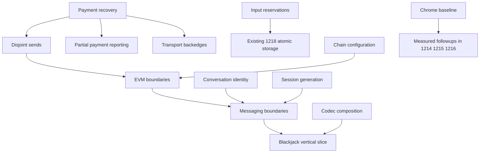

# Wallet messaging recovery and architecture plan

Restore reliable app-to-bot and email conversations first, then make the boundaries clear enough that future fixes have one owner. Chrome measurements and deterministic failure tests guide the work; a new abstraction is not a substitute for reproducing the broken flow.

## Status and authority

This is a reviewable proposal, not a published backlog or an implementation dispatch. The exact proposed issue bodies are in [tickets](tickets), with actions and dependency edges in [publication-manifest.json](publication-manifest.json). Proposed labels and assignees are empty. No issue, comment, claim, branch or production change was created by this planning pass.

Planning base: `f2231d2ff3d244ea5641e5444722271023c2fa2f`. The current uncommitted `AGENTS.md` payment/reservation additions are an explicit policy overlay, not production changes. Before implementation, commit the accepted policy and plan, refresh main, then replace the planning base in each dispatch packet with the actual full starting revision. Do not dispatch a worker against a stale base or omit the policy overlay.

Shammah owns product and architecture decisions. The root coordinator owns decomposition, shared contracts, conflicts and integration; each worker owns one claimed scope; independent review owns the readiness verdict. Publishing tickets does not approve all downstream implementation or resolve remaining questions.

## Accepted behavior

- One logical wallet/spend pool per canonical chain. An entry can use `[account, nonce]` inside that scope; cross-boundary records retain chain identity.
- HD derivation, spend inventory, private construction views, reservations and journals have distinct responsibilities. Consolidation means one owner per fact, not deleting necessary machinery.
- Normal Frank stealth payments can consume many independent inputs. Legacy external sends or contract calls may require dependent fan-in followed by a final send.
- Reservations protect the specific UTXO/account-nonce entries an operation uses. Disjoint sends and reconciliation must progress independently.
- Persist message/payment recovery before submission; retry the original authorized operation. Relay or recipient broadcast may occur after the sender loses its response. Discard and retry exhaustion are not financial finality.
- Recipients distinguish intended value from observed payment and see pending/partial/complete outcomes.
- Residual value may remain on an account under its next nonce. Maintenance respects reservations and economics; dirty cleanup differs from oversized-deposit distribution. Detailed thresholds and token layout remain open.
- A peer has one default thread plus independently created conversations with stable identities and editable subjects. Multiple QwenBot/AstraBot threads are supported. Subjects appear in the sidebar and chat header. Email-gateway threads and replies remain distinct even through the same gateway or with equal subjects. The owner explicitly supersedes #1178's blanket peer-collapse policy.
- Prefer clean format breaks and delete superseded implementations. No migration/alias machinery merely for old development data. A reset still requires a scoped data-owner contract and does not erase custody or recoverable payment/message obligations implicitly.

## First outcomes and later cleanup

| Draft | Outcome | Scheduling |
| --- | --- | --- |
| [Queue readiness](tickets/queue-readiness.md) | Explicit proposals cannot be auto-dispatched | Before unattended backlog-loop use; manual accepted work can proceed |
| [Chrome baseline](tickets/chrome-baseline.md) | Reproduce the broken flow and measure CPU, derivation, persistence and RPC waits | First; isolated profile and fixtures |
| [Payment recovery](tickets/payment-recovery.md) | Stop abandoning original operations on exhausted retries, discard or missing links | First financial repair; exact tests before changes |
| [Session generation](tickets/session-generation.md) | Old account derivations cannot overwrite a replacement session | Independent first fix |
| [Conversation identity](tickets/conversation-identity.md) | Correct peer isolation and multiple bot/email threads with subjects | First distinct-peer regression; staged identity replacement follows |
| [Input reservations](tickets/input-reservations.md) | Construction views own inputs and hide provisional state | Independent pool-boundary work after ownership mapping |
| [Disjoint sends](tickets/disjoint-sends.md) | A stalled operation does not block other available inputs | After recovery; prove actual admission authority |
| [Payment reporting](tickets/payment-reporting.md) | Show verified partial payment separately from delivered message/signed value | After recovery contract; trace existing intent first |
| [Chain configuration](tickets/chain-config.md) | Client and relay consume one source of shared identity | Independent after urgent workers have capacity |
| [Maintenance reachability](tickets/maintenance-reachability.md) | Find the real worker and distribution/eligibility policy | Read-only mapping can proceed independently |
| [Transport backedges](tickets/transport-backedges.md) | Delete obsolete or relocate needed wallet-owned transport records | Bugs-first order after recovery; shared-file mutex |
| [EVM boundaries](tickets/evm-boundaries.md) | Generic EVM contracts, explicit network config/adapters, alias deletion | After chain configuration and disjoint-send fixes |
| [Messaging boundaries](tickets/messaging-boundaries.md) | Stable-session headless delivery with thin UI/composition | After urgent correctness and family changes |
| [Codec composition](tickets/codec-composition.md) | Feature schemas use core validation without bypassing budgets | Separate contract acceptance; independent codec scope |
| [Blackjack slice](tickets/blackjack-slice.md) | One complete feature-owned schema/runtime/UI example | After codec and messaging seams |

[Parent outcome](tickets/baseline.md) remains open until child acceptance and integration evidence are complete. Drafts marked NEEDS_SPECIFICATION are not ready merely because they have file lists or scores. The investigation contracts can be accepted without accepting their eventual implementation choices.

## Dependency graph

Arrows mean predecessor must land before successor. File/semantic mutexes impose additional serialization even without an arrow.

Do not make the whole pool replacement a prerequisite for fixing canonical concurrency. Trace the active reservation authority first. Add an `input-reservations → disjoint-sends` edge only if that consumer actually depends on the changed pool. Otherwise retain and test the existing journal admission boundary. Likewise, recovery work must not wait for historical archiving.

The native edge list in the manifest is the publication source; local IDs become actual issue numbers. Parent rollup edges are included. Validate new edges against the current live graph before publishing them. Cross-scope scheduling constraints are not disguised as universal architecture prerequisites.

## Parallel worker arrangement

Use a bounded pool of up to three implementation/investigation workers initially, replenished as scopes finish rather than waiting for whole waves. Start with payment recovery, session-generation correctness, and the isolated Chrome harness/baseline. Source-only mapping of registry and maintenance can run while browser tooling is prepared. Do not run heavy tests/builds during timed profiling captures: the browser worker holds a quiet-measurement mutex.

After the session worker finishes, the conversation worker can begin. Input-reservation work can proceed alongside UI work once its ownership contract is explicit. Canonical recovery and disjoint-send edits are sequential. Codec work can run independently later, but its interface must be accepted before the feature slice starts.

Critical mutexes:

- `canonical-attempt-lifecycle` / `canonical-stamp-client`: recovery, disjoint sends, payment reporting, transport backedges, later messaging/feature integration.
- `chat-store-and-outbox-ui`: conversation replacement, receipt presentation, messaging extraction and plugin rendering. One owner of `chats.ts` at a time.
- `chain-inventory-reservations` / `inventory-durable-state`: view ownership, #1218 and any maintenance consumer changes.
- `chain-composition`: canonical integration, EVM naming/configuration and messaging extraction.
- `codec-schema-and-validation`: codec composition and subsequent feature extraction.
- `account-session-generation`: account lifecycle/derivation changes, including unrelated import/reset work.
- Browser profiles, databases, endpoints and owned process IDs are exclusive per worker. Never share the user's data or kill processes by pattern.

Before each production assignment, inspect live claims, open PRs, branches, worktrees and current main. Planning found open PRs #193 and #833 overlapping wallet/directory surfaces and numerous old worktrees; age does not establish that ownership is released. Resolve overlap before edits. Do not pop stashes or remove worktrees as part of this plan.

Each implementation worker gets an isolated persistent worktree through the repository workflow and a generated work-claim comment. Research workers used in planning were read-only and did not acquire production scopes. Full compilation and integration run at controlled concurrency, not three unrestricted monorepo builds.

## Dispatch packet and gates

The [three initial packets](dispatch-packets.md) are prepared for review. Use the [repository packet](../../../.agents/references/task-packet.md), with these concrete fields:

- Actual issue URL, accepted outcome and strong-lane-authored compact contract.
- Exact refreshed base SHA, isolated branch/worktree, allowed files and semantic mutexes; prohibited neighboring scopes.
- Satisfied native dependencies and remaining external blockers; explicit coordinator/product/reviewer ownership.
- Execution boundary: repository fixtures and owned loopback services. No live wallet access, funded send, external message or destructive reset without specific scope.
- Risk tier and lane. Financial, identity, wire, persistence and concurrency changes use strong; ordinary harness work may be tier 2, while runtime lifecycle or custody interaction raises it. No strong lane definition was available during planning, so the three research workers inherited the current model; resolve and report the lane at each actual dispatch.
- Named regression and proof; exact existing scripts/test filters after inspecting package configuration. No fictitious `factory/gates` command.
- Handoff: exact commit, changed files, gate matrix, requested/actual model, unresolved risks and next action. No model co-author trailers. Workers do not merge, close issues, terminate others' claims or clean up others' state.

Relevant existing gates are `yarn typecheck:fast`, wallet Jest through `yarn --cwd packages/wallet test <filter> --runInBand`, app Jest through `yarn --cwd app test:unit <filter>`, codec package tests/crosschecks and the appropriate existing browser harness. Select actual test paths after the allowed scope is frozen. No source gates were run for this documentation-only plan.

For each risky behavior: characterize/reproduce, land the required refactor separately if any, integrate consumers, delete predecessor, then review the candidate that will land. The coordinator combines accepted commits linearly and runs affected boundary tests; `$review` provides independent perspectives and verification. A worker's green test result is not parent completion.

## Existing backlog reuse

- #1218 remains the atomic persistence/archiving home. First align durable reservation/attempt/link ownership; do not demand archival machinery before repairing recovery. Its two outcomes may need separate landings.
- #1217 remains the legacy fan-in workflow home. Validate what is already on main and what survives restart; do not apply it to normal independent stealth payments.
- #1214, #1215 and #1216 remain balance/quote/RPC performance homes. Browser evidence decides missing work; an open issue or handoff is not proof its proposed patch is absent or correct.
- #784 and #785 already own typed vendor and raffle work. Keep those accepted behavior obligations, use the new feature seams, and do not create competing feature tickets.
- #821 is the mail-gateway epic. Conversation identity is an explicit correctness dependency for threading, not cosmetic cleanup.
- #68 and #681 are broader sync/multi-chain designs. Link relevant evidence without silently implementing their entire scope. #1178 and #950 are closed historical context, not proof the new target is already met.

Prepared comments for reused issues are in [existing-issue-comments](existing-issue-comments). Nothing is closed or relabeled. The live `ready_queue.py --repo schancel/frank --workers 3 --format json` returned no ready or dispatchable items during planning; this is not an automatic endorsement of draft readiness. The parser currently recognizes owner/acceptance words plus numeric score fields without honoring explicit non-ready status. The queue-readiness draft fixes that gap before unattended dispatch. These drafts retain proposed scores in prose, not machine-readable score lines. Promote score fields only after acceptance. After publication and acceptance, refresh the native graph and use the corrected script rather than constructing a competing scheduler.

## Remaining decisions

- Exact mapping between canonical journal reservations and ChainUtxoPool views, before removing global gates.
- Actual source of the owner's corrupted state and measured bottlenecks; isolated reproduction may not capture the original data failure.
- Exact feature module home and codec composition interface.
- Maintenance thresholds and asset inventory layout. These do not block the initial recovery/session/browser work.
- Concrete reset/export scope if old persisted data must be discarded. Preserve recovery obligations and custody separately.

The owner has resolved the thread-policy question: separate bot and email conversations are required, with subjects shown in navigation and the main chat view.
