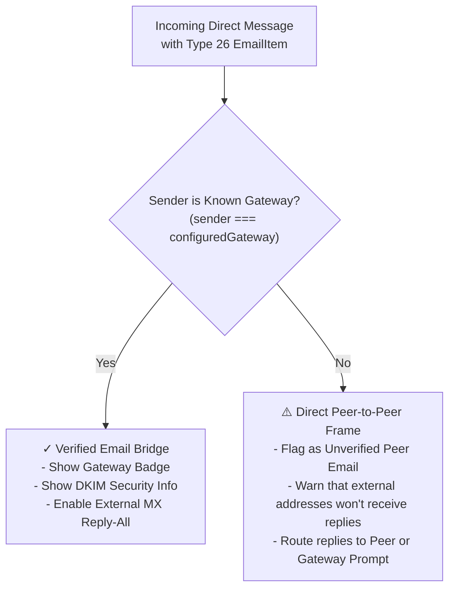

# Ticket: Handling Non-Gateway & Peer-Authored Email Frames (Type 26)

**Status:** Backlog / Open  
**Severity:** Medium (Security & Routing Invariant)  
**Affects:** `app/` (Chat View, EmailThreadView), `@frank/wallet`, `packages/cashweb`

---

## 1. Problem Statement

With Deterministic CBOR Type 26 (`EmailMessageItem`) standardized across `@frank/codec` and `app/src/stores/chats.ts`, any Frank account on any relay can manually construct a valid Type 26 CBOR frame and send it directly to another Frank account in a direct message or topic thread.

When the recipient's Frank app receives this message, it currently detects `items.some(i => i.type === 'email')` and transitions the conversation to `kind: 'email'`, rendering it inside `EmailThreadView.vue`.

This creates two critical vulnerabilities and UX failure modes:

1. **Phishing & Sender Spoofing:**
   - The untrusted peer can author arbitrary `from: { name: "Google Security", address: "no-reply@accounts.google.com" }`.
   - The recipient's UI would display the email in `EmailThreadView` alongside the `✉️ Email Bridge (via Frank Gateway)` badge, deceiving the user into believing the message was received and validated through an official Frank Email Gateway.
2. **Broken Outbound Routing & Reply Dead-End:**
   - In `EmailThreadView.vue`, clicking **Reply** or **Reply All** constructs a reply Type 26 message and sends it to the conversation's peer (`recipientAddress`).
   - If the conversation peer is a regular Frank user (rather than a running Frank Email Gateway with port 25 MX transport), that peer will simply receive a DM and will **not** dispatch it to the external `To:` and `Cc:` email addresses.
   - The user receives an optimistic delivery confirmation and erroneously assumes their email reply was delivered to external recipients.

---

## 2. Invariants & Security Boundaries

1. **Gateway Authenticity Invariant:**
   - An email thread MUST ONLY display `✉️ Email Bridge (via Frank Gateway)` and `[✓ DKIM Verified]` if the delivering Frank sender address matches a **Configured / Verified Frank Email Gateway**.
2. **Unverified Peer Warning Invariant:**
   - If a Type 26 email item is received from a sender that is *not* a known gateway, the client MUST visually flag the message as unverified direct peer communication.
3. **Outbound MX Routing Invariant:**
   - Outbound emails to external RFC 5322 addresses MUST only be dispatched through a verified gateway. If the conversation peer is an ordinary user, the client MUST either disallow email-style replies or explicitly prompt the user that replies stay strictly within Frank P2P and do not route to external email inboxes.

---

## 3. Proposed Architecture & Solution

### 3.1 Gateway Identity & Trust Model



1. **Trusted Gateway Registry / Setting:**
   - Store `emailBridgeGatewayAddress` in `useProfileStore` / settings store (defaulting to the official Frank Gateway address, e.g. `0xGateway...`).
   - Future enhancement: Support gateway discovery via DNS TXT records (`frank-gateway._frank.domain.org`) or Directory Admission.

2. **Classification in `app/src/stores/chats.ts`:**
   - When processing a message with `items.some(i => i.type === 'email')`:
     - Check `isGatewaySender = sameCanonicalAddress(message.senderAddress, trustedGatewayAddress)`.
     - Tag conversation/message:
       - If `isGatewaySender`: `kind = 'email'`, `verifiedGateway = true`.
       - If not: `kind = 'email'`, `verifiedGateway = false`.

### 3.2 UI Updates in `EmailThreadView.vue`

1. **Warning Header for Peer-Authored Frames:**
   - If `!verifiedGateway`:
     ```html
     <q-banner dense class="bg-amber-1 text-amber-10 q-px-md q-py-xs text-caption">
       <q-icon name="warning" size="16px" class="q-mr-xs" />
       <b>Unverified Email Frame:</b> This message was sent directly by Frank user {{ card.fromAddress }} (not via an Email Gateway). External recipients will not receive replies.
     </q-banner>
     ```
2. **Badge Conditioning:**
   - Hide `✉️ Email Bridge (via Frank Gateway)` when `!verifiedGateway`.
   - Show `⚠️ Direct P2P Email Frame (Unverified)`.
3. **Composer Routing Guard:**
   - When replying in an unverified peer thread:
     - Provide a clear choice:
       1. **Send P2P to Frank User** (informs them that external email addresses won't be notified).
       2. **Bridge via Gateway** (diverts the outbound DM to the configured Frank Gateway to actually send external emails).

---

## 4. Implementation Checklist

- [ ] Add `emailBridgeGatewayAddress` to `app/src/utils/constants.ts` and settings.
- [ ] Add `verifiedGateway?: boolean` property to `Conversation` in `app/src/stores/chats.ts`.
- [ ] Validate sender against `emailBridgeGatewayAddress` when hydrating and receiving messages.
- [ ] Update `EmailThreadView.vue`:
  - [ ] Render security banner when `!conversation?.verifiedGateway`.
  - [ ] Render `⚠️ Unverified P2P Email` badge instead of gateway badge.
  - [ ] Disable external email Reply-All or require confirmation when peer is not a gateway.
- [ ] Add unit tests verifying untrusted peer email frames trigger the warning banner and avoid gateway trust badges.
