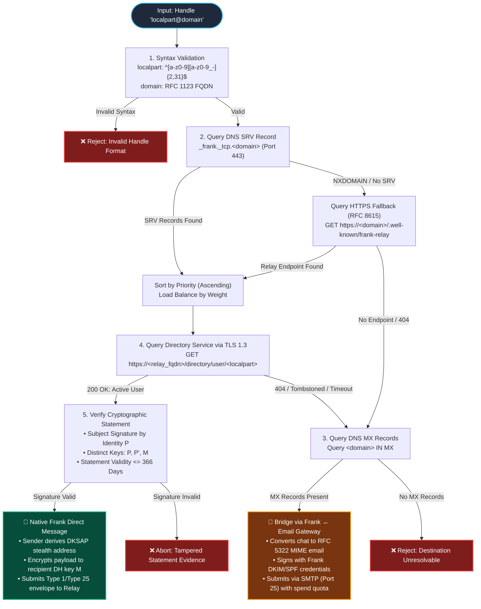
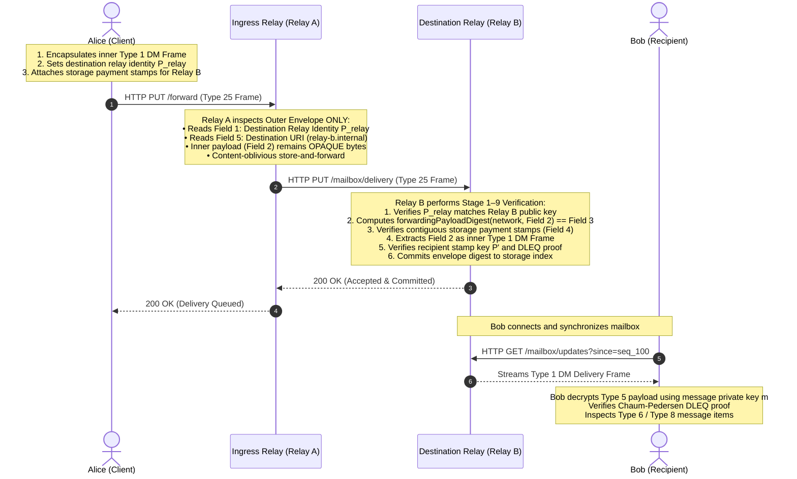
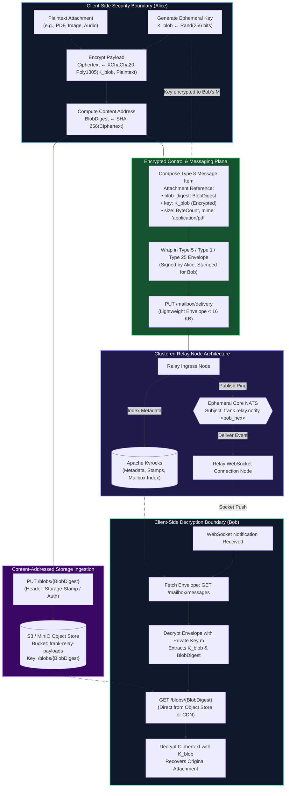

# VitePress Documentation Site Architecture & Protocol Visualizations

- **Issue Reference**: Parent Epic #821, Issue #997 ("Maintain structured docs tree with static site renderer and protocol diagrams")
- **Author**: Docs Site Architect
- **Status**: Accepted Design & Implementation Proposal
- **Target Location**: `packages/docs` (Yarn Workspace) + `docs/` canonical tree

---

## 1. Context & Motivation

The Frank monorepo contains critical protocol specifications, cryptographic algorithms, deterministic CBOR schemas, and clustering architectures. As the protocol matures through Track C (#981, #982, #983, #986) and Track D (#973, #976), maintaining documentation exclusively in disparate raw markdown and CDDL files creates several operational bottlenecks:

1. **Lack of Visual Flow**: Complex protocol state machines (such as DKSAP stamp derivation, dual-protocol DNS routing, and hop-by-hop Type 25 store-and-forward envelopes) are difficult to audit without interactive sequence diagrams and architectural flowcharts.
2. **Formula Readability**: Cryptographic proofs (Chaum-Pedersen DLEQ $c \parallel s$, Galois Field $\text{GF}(2^5)$ operations in Codex32, and discrete log relations) require LaTeX mathematical rendering ($\KaTeX$).
3. **Discoverability**: External integrators, client SDK developers, and relay operators need instant full-text search, version-tagged schemas, and navigable navigation sidebars.

This document specifies the architecture, inventory, configuration, and implementation plan for **Frank Docs**, built on **VitePress**.

---

## 2. Complete Monorepo Documentation Inventory

The Frank repository currently contains 80+ documentation, CDDL, and specification files across four main layers:

### 2.1 Core Protocol Specifications (`docs/`)

- `docs/CASHWEB-PROTOCOL-SPEC.md`: Human-semantics root and front door for Cashweb protocol; messaging semantics, identity, directory, encryption suites, and relay contracts.
- `docs/dns-dual-protocol-routing.md`: Dual-protocol DNS resolution specification (RFC 2782 SRV + RFC 5321 MX + RFC 8615 well-known fallback). Defines how `user@domain` resolves to native Frank Cashweb relays or falls back to SMTP email gateways.
- `docs/clustered-relay-architecture.md`: Clustered relay architecture and dual-mode execution specification (Standalone mode vs Clustered mode with Apache Kvrocks CAS, Core NATS ephemeral messaging, and MinIO/S3 content-addressed blob storage).
- `docs/backend-topology.md`: Topology of backend daemons, auth nodes, relay nodes, reverse proxies, and database instances.
- `docs/public-federation-plan.md`: Federated relay topology, peer discovery, gossip protocols, storage rate limiting, and spam deterrence.
- `docs/metrics.md`: Relay operational metrics, Prometheus monitoring counters, histograms, and health probes.
- `docs/ambient-privacy-and-graph-entropy.md`: Graph entropy, timing obfuscation, stealth address transaction anonymity sets, and ambient cover traffic analysis.
- `docs/codex32-signup-and-backup-specification.md`: Codex32 (BIP-93) secret sharing, checksummed Shamir secret sharing over $\text{GF}(32)$, paper backup ceremonies, threshold account recovery.
- `docs/domain-derivation-registry-v1.md`: Hierarchical deterministic key derivation path registry for domains, identity keys, stamp keys, and stealth wallets.
- `docs/preview-vault-policy.md`: Security policies, admission gates, sandbox boundaries for unauthenticated preview vaults.
- `docs/nakamoto-audit.md`: Cryptographic audit of Satoshi/Nakamoto UTXO consensus logic, cashaddr encoding, SLIP-0044 coin types.
- `docs/atomic-swap-specification.md`: Cross-chain atomic swaps (Lotus, BCH, EVM/Monad, BTC), adaptor signatures (ECDSA/Schnorr), hash timelock contracts (HTLC), discrete log contracts.

### 2.2 Deterministic CBOR v1 & Protocol Schemas (`docs/protocol/`)

- `docs/protocol/cbor/README.md`: Normative FRNK deterministic CBOR version 1 specification (framing `FRNK\x01`, common envelope, canonical profile, resource limits R1–R6, semantic rules S1–S10a, test vectors).
- `docs/protocol/INVARIANTS.md`: Immutable security invariants, fail-closed validation rules, and zero-trust assumptions.
- `docs/protocol/message-stamp-derivation.md`: Mathematical derivation of DKSAP message stamps ($P'$, $E$, $X$, Chaum-Pedersen DLEQ proofs $c \parallel s$, child key derivation $t_i \cdot d'$).
- `docs/protocol/cbor/common.cddl`: Envelope structure (`type_id`, `schema_version`, `min_reader_version`, `payload`), `frank-envelope`, `account-ref`, `timestamp`, `digest-32`, `uuid-16`.
- `docs/protocol/cbor/direct-message.cddl`: Type 1 (`direct-message-delivery`), Type 5 (`recipient-encrypted-payload-v1` and `v2`), Type 6 (`encrypted-message-content`), Type 8 (`message-content-revision`), Type 16 (`container-message-item`), Type 17 (`text-message-item`), Type 19 (`stealth-message-item`), Type 24 (`channel-update-item` with game/swap/raffle payloads), and Type 25 (`forwarding-delivery-envelope`).
- `docs/protocol/cbor/directory.cddl`: Type 2 (`directory-attestation`), Type 4 (`directory-statement`), Type 7 (`key-transition-statement`).
- `docs/protocol/cbor/checkpoint.cddl`: Type 3 (`mailbox-checkpoint`), journal facts, opaque checkpoint sections.
- `docs/protocol/cbor/topic.cddl`: Type 9 (`topic-post`), Type 10 (`topic-post-submission`), Type 11 (`topic-vote-submission`), Type 12–15 forum items.
- `docs/protocol/cbor/topic-http-coexistence.md`: HTTP wire mapping for Monad topic write transport.
- `docs/protocol/chains/README.md` & `chains/v1.json`: Multi-chain network tag registry.
- `docs/protocol/forum-runtime-storage.md`: Forum storage, indices, and runtime queries.
- `docs/protocol/proposals/*/`: Active protocol proposals (Directory Preview v4, Forum Content Read, Message Stamp Derivation).
- `docs/protocol/cbor/vectors/*.json`: 15+ canonical test vector suites for cross-language validation.

### 2.3 Client Libraries & Packages (`packages/`)

- `packages/frank-codec`: TypeScript reference codec for FRNK-CBOR framing, canonical CBOR encoding, stage 1–9 validation, and Type 25 forwarding envelope.
- `packages/cashweb`: Client SDK for Cashweb messaging, conversation state machines, and mailbox synchronization.
- `packages/wallet`: Multi-chain wallet engine (Monad EVM + Nakamoto UTXO), DKSAP stealth address generation, fee calculation, and sweep transactions.
- `packages/crypto-box`: Pure AEAD and KEM cryptographic suite (XChaCha20-Poly1305, DHKEM secp256k1, HKDF-SHA256).
- `packages/contracts`: Solidity smart contracts for Monad (Directory Registry, Escrow, State Channel Settlement).
- `packages/codex32`: BIP-93 Codex32 Shamir secret sharing implementation in TypeScript.
- `packages/nakamoto`: Pure TypeScript Bitcoin/Nakamoto script engine and transaction builder.
- `packages/bitcore-lib-xpi`: Complete Bitcore library for Lotus/BCH UTXO chains with 15 dedicated markdown subdocs.
- `packages/adaptor-signatures`: 2-of-2 ECDSA and Schnorr adaptor signatures for atomic swaps.
- `packages/threshold-ecdsa` & `joint-signer`: Distributed threshold key generation and signing.
- `packages/swap-protocol`: P2P atomic swap negotiation and execution protocol.
- `packages/bot` & `bot-framework`: Autonomous bot clients, demo agents, and directory trust probing.
- `packages/cli`: Standalone CLI utilities for Monad Cashweb.
- `packages/account-vault` & `account-recovery`: Client-side encrypted key vault and recovery schemes.
- `packages/directory-admission`: Directory admission policy enforcement.
- `packages/domain-roots` & `role-keys`: Hierarchical domain root verification and role key derivation.

### 2.4 Backend Rust Daemons (`backend/`)

- `backend/cashweb`: Core `cashwebd` relay daemon, RocksDB storage engine, HTTP API endpoints, WebSocket sync server, and directory services.
- `backend/cashweb/frank-cbor`: High-performance zero-copy Rust implementation of FRNK-CBOR v1, Type 1–25 validation stages, and hash commitments.
- `backend/cashweb/cashweb-registry`: Federated directory registry server.
- `backend/cashweb/cashweb-http-utils`: Shared Actix/Axum/Hyper HTTP utilities.
- `backend/cashweb/cashweb-pop-token`: Proof-of-Payment token generation and authentication.
- `backend/bitcoinsuite`: Rust Bitcoin, Lotus, and BCH utilities, Chronik client integration.

---

## 3. High-Assurance Protocol Architecture Diagrams

### 3.1 Frank Dual-Protocol DNS Routing (SRV + MX)



---

### 3.2 Store-and-Forward Forwarding Delivery Envelope (Type 25)



---

### 3.3 Content-Addressed Encrypted Blob Storage & Attachments



---

## 4. Recommended Package Setup & Scaffold Plan

### 4.1 Yarn Workspace Structure

In root `package.json`, `packages/*` is already configured in `workspaces`. Adding `packages/docs` allows isolating documentation tooling dependencies without risking build conflicts with Vue/Quasar in `app/`.

```text
packages/docs/
├── .vitepress/
│   ├── config.ts              # Global navigation, plugins, search, KaTeX, Mermaid
│   └── theme/
│       ├── custom.css         # Styling, brand colors, diagram margins
│       └── index.ts           # Theme extension & KaTeX css import
├── index.md                   # Documentation portal homepage
├── protocol/                  # Curated protocol pages & diagrams
│   ├── dns-routing.md
│   ├── forwarding-envelope.md
│   └── blob-storage.md
├── package.json               # VitePress & plugin dependencies
└── README.md                  # Developer instructions
```

### 4.2 Root `package.json` Convenience Scripts

Add the following commands to root `package.json`:

```json
{
  "scripts": {
    "docs:dev": "yarn workspace @frank/docs dev",
    "docs:build": "yarn workspace @frank/docs build",
    "docs:preview": "yarn workspace @frank/docs preview"
  }
}
```

### 4.3 GitHub Actions Workflow (`.github/workflows/docs.yml`)

Automates preview building on pull requests and static site deployment to GitHub Pages or Cloudflare Pages on merges to `main`.
