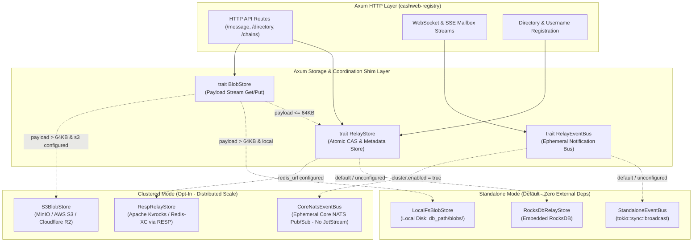

# Clustered Relay Architecture & Dual-Mode Execution

**Status**: Architecture Standard & Scoping Specification  
**Parent Epic**: #821  
**Primary Invariant**: **Zero-overhead, zero-external-dependency standalone operation MUST remain the default.** Laypeople, single-node self-hosters, CI runners, and unit/integration tests must never be forced to run external cluster services.

---

## 1. Executive Summary & Design Principles

The Frank Cashweb relay daemon (`cashwebd` / `cashweb-registry`) is designed to scale horizontally across multi-region server clusters without sacrificing the ease of self-hosting for individual users.

RocksDB LSM-trees provide phenomenal performance for small keys and values (indices, hashes, routing metadata, user handles), but suffer from severe write amplification and compaction churn when forced to store large binary payloads (> 64KB - 1MB). Furthermore, TiKV was evaluated and discarded due to placement driver (PD) complexity and heavyweight operational overhead.

Instead, the architecture enforces a clean separation of concerns:

1. **Metadata & Unique Indexing**: Embedded **RocksDB** (Standalone) / **Apache Kvrocks** or **Redis-XC** (Clustered - RocksDB-backed, Redis RESP protocol, distributed disk-resident KV with atomic transactions).
2. **Hybrid Blob Storage**: Inline in KV store for small payloads (`<= 64KB`), offloaded to an **S3-Compatible Blob Store** (MinIO, AWS S3, Cloudflare R2, or GCS, with local filesystem fallback) for large payloads (`> 64KB`).
3. **Real-Time Notification Bus**: In-memory `tokio::sync::broadcast` (Standalone) / **Ephemeral Core NATS** (Clustered - purely in-memory pub/sub for instant WebSocket/SSE wake-up pings, with **zero JetStream persistence overhead**).
4. **Air-Gapped Mobile Wallet Treasury**: Storage stamps can be paid directly to an operator's static mobile wallet (e.g. Monad/EVM address) without the server ever holding spending keys, eliminating the "dust sweeping nightmare".
5. **Signed Cluster Authority & Anti-Swarm Handshake**: Relays present a signed cluster attestation during peer handshakes, preventing internal cluster nodes from federating with each other and capping cross-cluster links (anti-swarm).

| Role                      | Standalone Mode (Default)                       | Clustered Mode (Production Multi-Node)                      |
| ------------------------- | ----------------------------------------------- | ----------------------------------------------------------- |
| **Target Audience**       | Laypeople, home labs, developers, CI/unit tests | High-availability clusters, multi-region relays             |
| **External Dependencies** | **None** (single binary)                        | Apache Kvrocks (or Redis-XC) + S3/MinIO + Core NATS         |
| **Metadata & CAS KV**     | Embedded RocksDB (in-process)                   | **Apache Kvrocks** (RocksDB-backed, Redis RESP, atomic CAS) |
| **Payload Storage**       | Inline (`<=64KB`) / Local disk (`>64KB`)        | Inline (`<=64KB`) / **S3-Compatible Blob Store** (`>64KB`)  |
| **Live Notification Bus** | `tokio::sync::broadcast` (in-memory)            | **Ephemeral Core NATS** (pure pub/sub, no JetStream)        |
| **Storage Stamp Payout**  | Direct static operator wallet / treasury        | Direct static cluster treasury / mobile wallet              |

---

## 2. Dual-Mode Abstraction Architecture

All HTTP handlers, WebSocket session dispatchers, and directory controllers interact **exclusively** with unified Rust traits via Axum state dependency injection (`State<Arc<dyn RelayStore>>` and `State<Arc<dyn BlobStore>>`). Neither domain logic nor API handlers ever know whether the underlying driver is standalone or clustered.



---

## 3. Configuration & Runtime Selection

Configuration lives in `cashweb-config` (`RegistryConf`).

### 3.1 Default Standalone Configuration (`frank.toml`)

For a layperson or self-hoster, the `[cluster]` section is omitted entirely. An operator can simply plug in their personal mobile wallet address to receive stamps directly:

```toml
# Default single-node setup for laypeople & self-hosters
[registry]
db_path = "/var/lib/frank/db"
bind_addr = "0.0.0.0:443"

[registry.payment]
# Operator's personal mobile wallet address!
# The server never holds private keys; funds land directly in your wallet.
payout_address = "0x71C...B29"
stamp_price_monad = "0.001"
```

_Result_: `cashwebd` starts immediately, spawns in-process broadcast buses, opens local RocksDB, streams large files to local disk, and routes payment stamps directly to the operator's mobile wallet with zero sweeping or setup friction.

### 3.2 Clustered Configuration (`frank.toml`)

For multi-node deployments behind a load balancer:

```toml
# Multi-node clustered deployment
[registry]
db_path = "/var/lib/frank/db"
bind_addr = "0.0.0.0:443"

[registry.payment]
payout_address = "0x71C...B29" # Cluster treasury or mobile wallet
stamp_price_monad = "0.001"

[registry.cluster]
enabled = true
driver = "kvrocks"
kvrocks_url = "redis://kvrocks-cluster:6666"
nats_url = "nats://nats-cluster:4222"
cluster_name = "frank-prod-us"
cluster_id = "550e8400-e29b-41d4-a716-446655440000"
authority_pubkey = "02abcd...ef" # Cluster Domain Authority Public Key

[registry.blob_storage]
provider = "s3"
endpoint = "https://minio.internal:9000"
bucket = "frank-relay-payloads"
region = "us-east-1"
access_key = "..."
secret_key = "..."
```

---

## 4. Storage Stamps & The Air-Gapped Mobile Wallet Pattern

### 4.1 The "Dust Sweeping Nightmare" Avoided

- **User-to-User Messages**: Use DKSAP stealth addresses to maintain sender/recipient unlinkability and privacy.
- **Relay Storage Stamps**: Senders pay the relay for hosting and bandwidth. The relay is an already-public infrastructure provider whose pricing and endpoints are advertised in DNS.
- **Direct Payout UX**: Senders construct the Type 25 outer forwarding envelope with `payment-member` targeting the relay's static `payout_address` (`child_index: 0`).
- **Zero Sweeping Overhead**:
  1. The operator receives funds straight into their mobile wallet in real time.
  2. The relay server never needs to store hot private spending keys. If the server is compromised, attacker cannot drain the operator's funds.
  3. No dust accumulation, no gas fee compaction waste, and no nonce contention.

---

## 5. Signed Cluster Authority & Anti-Swarm Peering (#88, #455, #457)

To prevent cluster nodes from accidentally federating with each other or creating redundant connections to foreign clusters:

### 5.1 Mutual Signed Attestation Handshake

Each node possesses a short-lived attestation signed by the cluster's Domain Authority Key:

```rust
pub struct NodeClusterAttestation {
    pub cluster_authority_pubkey: [u8; 33],
    pub cluster_id: Uuid,
    pub domain: String,
    pub node_pubkey: [u8; 33],
    pub valid_until: u64,
    pub authority_signature: Vec<u8>,
}
```

### 5.2 Handshake Rules:

1. **Intra-Cluster Self-Peering Rejection**: If `peer.cluster_authority_pubkey == my.cluster_authority_pubkey`, the node drops public P2P peering immediately. Internal siblings communicate solely through Core NATS and shared Kvrocks/S3.
2. **Foreign Cluster Deduplication (Anti-Swarm)**: If a foreign cluster has 10 nodes (B1...B10), our relay allows at most `max_peers_per_cluster = 1` (or 2 for redundancy) active connections to that `cluster_authority_pubkey`. Subsequent nodes presenting the same cluster authority are cleanly rejected with `ClusterAlreadyConnected`.
3. **Decoupled User Profiles**: User profiles only reference human-readable handles (`alice@domain.org`). User profiles never contain relay node IPs or cluster topology, eliminating profile churn when relay hardware rotates.

---

## 6. Full Scoping for Track C Issues

### 6.1 Issue #981: Cluster-wide Username Uniqueness & Apache Kvrocks CAS

- **Objective**: Prevent two users from concurrently claiming the same username on two separate cluster nodes.
- **Standalone Mode Behavior**:
  - Validates handle syntax (`^[a-z0-9][a-z0-9_-]{2,31}$`).
  - Executes atomic check-and-insert directly in RocksDB `usernames` column family using a single RocksDB write batch.
  - If already exists: checks if tombstone cooling period has elapsed. If active, returns `HTTP 409 Conflict`.
- **Clustered Mode Behavior**:
  - Leverages **Apache Kvrocks** (speaking Redis RESP protocol over RocksDB disk backing) or **Redis-XC**.
  - Uses atomic conditional command (`SET username:<handle> <statement_bytes> NX EX <cooling_ttl>` or a lightweight Lua script for atomic revision verification).
  - If the key exists, Kvrocks returns `nil`, which `cashwebd` translates to `HTTP 409 Conflict`.
  - On successful CAS, caches to local RocksDB for instant read performance.
- **Testing Invariant**:
  - Integration test suite MUST run in Standalone mode during standard CI (`cargo test`).
  - Clustered integration tests run against an ephemeral Docker/testcontainers Kvrocks instance in an optional integration test lane.

### 6.2 Issue #982: Real-time Message Fan-Out via Ephemeral Core NATS

- **Objective**: When a message arrives at Node A, ensure Node B (where the recipient has an active WebSocket/SSE sync connection) immediately receives a wake-up ping and pushes the update to the recipient's browser.
- **Standalone Mode Behavior**:
  - Upon message arrival and validation, publishes event to an in-memory `tokio::sync::broadcast::Sender`.
  - Connected WebSockets on the same process receive the message event and stream it out.
- **Clustered Mode Behavior**:
  - Node A durably stores the message payload in Blob Storage (S3/MinIO) or inline if `<= 64KB`, and indexes the envelope in Kvrocks.
  - Node A publishes a tiny, ephemeral notification to Core NATS:
    `frank.relay.notify.<recipient_account_address_hex>`
  - **No JetStream**: Ephemeral Core NATS runs purely in memory with zero WAL or persistence overhead.
  - Every cluster node subscribes to notification subjects matching its currently active WebSocket sessions.
  - If a client is offline, the NATS ping is safely discarded; on next connection, the client catches up via standard inbox HTTP queries.
  - **Content-Oblivious Boundary**: The notification carries only the recipient address hex and message digest; message ciphertext remains end-to-end encrypted.

### 6.3 Issue #983: Hybrid Blob Storage (S3 / MinIO) & Email Gateway Multi-Worker Pool

- **Objective**: Decouple large message payloads and email attachments from RocksDB/Kvrocks, and scale `packages/email-gateway` horizontally across multiple worker nodes.
- **Hybrid Blob Offloading**:
  - Payloads `<= 64KB` remain stored inline in the KV store for maximum speed and zero network latency.
  - Payloads `> 64KB` are streamed directly to the configured `BlobStore` provider (MinIO / S3 in clustered mode, or `blobs/` on filesystem in standalone mode).
  - The KV store (RocksDB or Kvrocks) holds only the envelope digest, recipient indexing, storage payment stamp receipts, and expiration metadata.
- **Clustered Gateway Behavior**:
  - Worker nodes share the common S3/MinIO bucket for raw MIME email bodies.
  - Ephemeral task assignment uses Core NATS queue subscriptions (`mail.inbound.queue`) to balance inbound SMTP parsing across workers with automatic failover if a worker disconnects.
  - Avoids double-spending of DKSAP payments through idempotent message transaction deduplication.

### 6.4 Issue #998: Cluster Identity via Relay Descriptors & Anti-Self-Peering Isolation

- **Objective**: Differentiate intra-cluster mesh communication (Kvrocks and Core NATS) from inter-cluster federation (Relay Descriptors and Type 25 forwarding bundles) to eliminate intra-cluster self-peering and coordinate cross-cluster message and forum bundle dispatch.
- **Standalone Mode Behavior**:
  - Operates a local `RelayDescriptor` representing the single node.
  - Rejects self-peering via loopback detection and standard duplicate endpoint filters in `p2p/peers.rs`.
  - Dispatches outbound forwarding bundles (Type 25 frames) and forum posts directly to target relay endpoints via HTTP PUT.
- **Clustered Mode Behavior**:
  - **Unified Relay Descriptor**: Nodes sharing a `cluster_name` advertise a shared cluster `RelayDescriptor` containing public ingress endpoints. User directory records bind to the cluster's `relay_descriptor_hash`.
  - **Anti-Self-Peering Filter**:
    - Discovered peer candidates matching `cluster_name` or known intra-cluster node IDs are strictly suppressed from the P2P HTTP crawler and gossip table.
    - Intra-cluster state replication occurs exclusively over the internal NATS bus/Kvrocks mesh; nodes never establish P2P HTTP peering with other nodes in the same cluster.
  - **Clustered Outbound Bundle Dispatch (Core NATS Queue Group)**:
    - Outbound cross-relay forwarding bundles (Type 25 frames with storage stamps) and forum/topic events are dispatched via a Core NATS queue subscription: `cluster.forwarding.dispatch`.
    - Exactly one worker in the source cluster claims each delivery job, preventing $N$-fold redundant forwarding storms to external relays.
    - Automatic exponential backoff and retry handling on HTTP 503 or transient network failure.

---

## 7. Security & Failure Invariants

1. **Air-Gapped Revenue Safety**:
   - The relay server never holds the private key for the `payout_address`. A total server takeover cannot drain accumulated stamp revenue.
2. **Fail-Closed on Coordination Loss**:
   - If a clustered relay loses connectivity to Apache Kvrocks, it MUST fail-closed on new registrations and username claims (returning `HTTP 503 Service Unavailable`), preventing split-brain double-claims.
   - Mailbox reads of already-cached local data MAY continue serving in read-only mode.
3. **Ephemeral Pub/Sub Resilience**:
   - Dropped NATS notifications do NOT result in data loss because all messages are durably committed to the blob store and indexed before notification dispatch. The client protocol includes reconnect sync intervals.
4. **Graceful Single-Binary Degradation**:
   - If `[registry.cluster]` is absent or `enabled = false`, `cashwebd` compiles and runs as a completely self-contained binary without initializing any network sockets or client libraries for NATS or Kvrocks.
