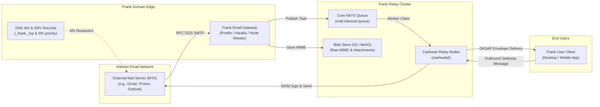
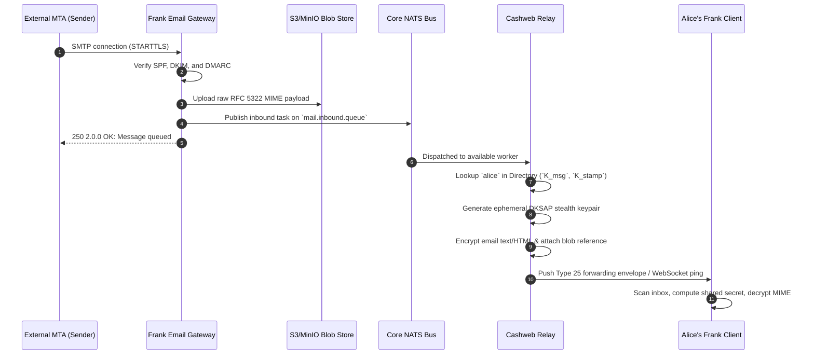
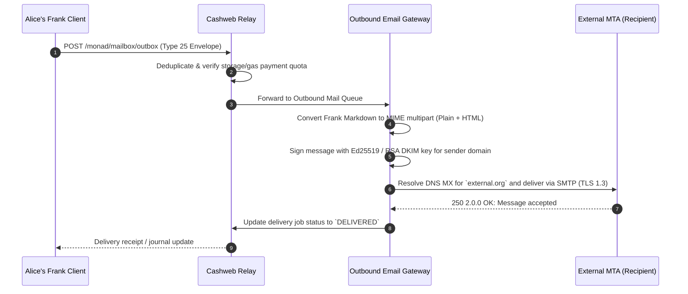

# Inbound & Outbound Email Gateway Architecture

**Status**: Architecture Specification & Production Standard  
**Components**: `packages/mail-gateway`, `packages/frank-codec`, `cashweb-registry`  
**Related Specifications**: [Dual-Protocol DNS Routing](/protocol/dns-routing), [Clustered Relay Architecture](/architecture/clustered-relay)

---

## 1. Overview

The Frank Email Gateway (`packages/mail-gateway`) bridges traditional Internet email (RFC 5321 SMTP / RFC 5322 MIME) with Frank's native end-to-end encrypted Dual-Key Stealth Address Protocol (DKSAP) messaging network.

This architecture enables users with standard email clients (Apple Mail, Thunderbird, Gmail, Outlook) to communicate seamlessly with Frank users possessing `user@domain` handles, and allows Frank users to send cryptographic chat messages that arrive as standard signed emails to external recipients.

---

## 2. Inbound Email Flow (SMTP &rarr; Frank DKSAP)

When an external email sender transmits a message to `alice@example.com`:

### 2.1 Security & Inbound Sanitization

1. **DKIM / SPF / DMARC Verification**: Inbound messages undergo strict cryptographic verification. Authentication results are injected into internal envelope metadata (`Authentication-Results` header).
2. **HTML & Attachment Sanitization**: Malicious script tags, tracking pixels, and active content are stripped before encapsulation into Frank markdown chat format.
3. **Payload Decoupling**: Large email attachments (> 64 KiB) are extracted and written directly to the content-addressed blob store. The encrypted DM payload contains encrypted URI pointers and SHA-256 hashes.

---

## 3. Outbound Message Flow (Frank Chat &rarr; Internet SMTP)

When a Frank user sends a message to a traditional email recipient (e.g. `bob@external.org`):

---

## 4. Multi-Worker Queueing and Scaling

To handle bursty email traffic without blocking relay API workers:

1. **Queue Groups**: Workers subscribe to `mail.inbound.queue` using NATS queue group semantics. Exactly one worker claims each inbound email delivery job.
2. **Crash Resilience**: If a worker crashes while processing a message, NATS re-delivers the job after an unacknowledged timeout.
3. **Idempotency**: Inbound SMTP `Message-ID` headers are combined with the cryptographic hash of the raw MIME body to produce an idempotent deduplication key in Apache Kvrocks. Re-transmitted SMTP deliveries do not create duplicate Frank DMs.
