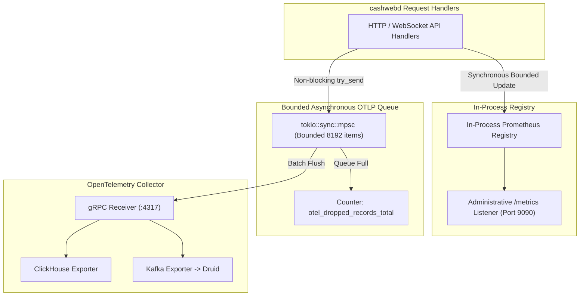

# Relay Observability & Prometheus Metrics

**Status**: Design Specification & Operational Standard  
**Components**: `cashwebd`, `packages/mail-gateway`  
**Primary Invariant**: Telemetry delivery is not guaranteed. A metrics or analytics outage MUST NOT make a relay API unavailable.

---

## 1. Goals & Non-Goals

### Goals

- Provide operators with low-cardinality Prometheus metrics for every public relay API.
- Measure chain-proxy HTTP and WebSocket traffic by shared chain identifier, normalized operation, authentication class, outcome, quota use, size, and latency.
- Support optional asynchronous OpenTelemetry (OTLP) export for traces and structured analytical events.
- Route telemetry independently to ClickHouse and Kafka-backed Druid ingestion without adding database clients to request handlers.
- Inspect JSON-RPC envelopes with bounded memory, even when allowed responses exceed hundreds of megabytes.
- Reject unsafe cardinality, queue, retry, and memory configurations at startup.

### Non-Goals

- Prometheus is not an event store, audit log, billing ledger, or per-customer request history.
- Telemetry parameters, response results, message bodies, transaction bytes, and wallet identifiers are strictly prohibited from telemetry.

---

## 2. Telemetry Pipeline Architecture



Prometheus remains completely independent of the OpenTelemetry Collector. The relay updates counters, gauges, and histograms in process and exposes them on a separately configured administrative listener.

---

## 3. Configuration

```toml
[observability]
service_name = "cashwebd"

[observability.prometheus]
enabled = true
host = "127.0.0.1:9090"

[observability.otlp]
enabled = false
endpoint = "http://otel-collector:4317"
protocol = "grpc"
queue_capacity = 8192
batch_size = 512
max_record_bytes = 16384
memory_budget_bytes = 33554432
max_in_flight_batches = 2
flush_interval_ms = 1000
timeout_ms = 3000
retry_max_elapsed_ms = 30000
trace_sample_ratio = 0.01
headers_env = "CASHWEBD_OTLP_HEADERS"
```

Configuration validation rejects zero or unbounded queues, batches larger than queues, unreasonable timeouts, invalid sampling ratios, and telemetry memory estimates exceeding the configured budget.

---

## 4. Cardinality & Privacy Contract

Prometheus labels are an explicit allowlist, not arbitrary key/value pairs.

### Allowed Bounded Dimensions

| Dimension         | Values                                                                                   |
| ----------------- | ---------------------------------------------------------------------------------------- |
| `api_family`      | Enumerated families such as `profile`, `mailbox`, `topic`, `json_rpc`, `chronik`, `peer` |
| `chain`           | An identifier from the versioned shared chain registry (e.g. `monad-testnet`, `lotus`)   |
| `rpc_method`      | A method from that family's server allowlist, plus `batch`, `invalid`, or `other`        |
| `route`           | A compile-time route template, never the concrete URI                                    |
| `transport`       | `http` or `ws`                                                                           |
| `auth_class`      | `anonymous` or `customer`                                                                |
| `outcome`         | A finite handler-defined enum                                                            |
| `status_class`    | `1xx`, `2xx`, `3xx`, `4xx`, `5xx`, or `no_response`                                      |
| `broadcast_state` | `none`, `not_attempted`, `unknown`, or `accepted`                                        |
| `quota_class`     | A finite configured quota category, never an identity                                    |

### Strictly Forbidden in Telemetry

- Capability tokens, authorization headers, or secret-bearing URLs.
- Customer/profile addresses, public keys, IP addresses, or peer-specific identifiers.
- Transaction hashes, block hashes, JSON-RPC IDs, Chronik path parameters, or mailbox cursors.
- Raw method names not admitted by a bounded allowlist.
- Request parameters, response bodies, or error strings from an upstream provider.

---

## 5. Streaming JSON-RPC Inspection

To support proxying high-throughput EVM and UTXO chains without inflating memory usage:

- **Zero-Tree Streaming**: The relay inspects JSON-RPC request and response envelopes incrementally over 64 KiB chunks rather than deserializing the full JSON object tree.
- **Constant Memory Ceiling**: Heap usage is bounded to approximately 128 KiB per stream, independent of whether the response body is 1 MiB or 250 MiB.
- **Fail-Closed Validation**: Requests are completely validated before any bytes are forwarded upstream.
