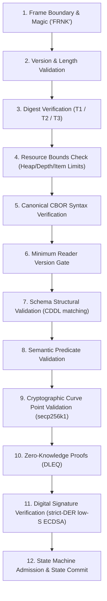

# Deterministic CBOR v1 (FRNK) Specification

**Status**: Normative Encoding and Validation Standard  
**Implementations**: `@frank/codec` (TypeScript), `frank-cbor` (Rust zero-copy parser)  
**Conformance Vectors**: `docs/protocol/cbor/vectors/`

---

## 1. Framing Architecture

Every independently stored, signed, hashed, or forwarded Frank object is serialized as an exact binary **frame**:

```text
+-------------------+---------+-------------------------------------------------------+
| Field             | Size    | Description                                           |
+-------------------+---------+-------------------------------------------------------+
| Magic Bytes       | 4 bytes | ASCII "FRNK" (0x46 0x52 0x4e 0x4b)                    |
| Major Version     | 1 byte  | Protocol major version (0x01)                         |
| Minor Version     | 1 byte  | Protocol minor version (0x00)                         |
| Reserved Flags    | 2 bytes | 0x00 0x00                                             |
| Frame Length      | 4 bytes | Big-endian uint32 (header + payload, 16..33554432)   |
| Type ID           | 2 bytes | Big-endian uint16 identifying the object schema       |
| Schema Version    | 1 byte  | uint8 (>= 1)                                          |
| Min Reader Vers   | 1 byte  | uint8 (>= 1, <= Schema Version)                       |
+-------------------+---------+-------------------------------------------------------+
| Payload Bytes     | Var     | Restricted Canonical CBOR Root Item                   |
+-------------------+---------+-------------------------------------------------------+
```

---

## 2. Canonical Encoding Constraints (Strict CBOR)

To ensure byte-for-byte deterministic hashing across all languages (TypeScript, Rust, Go, Python):

1. **Integer Map Keys**: All protocol map keys MUST be unsigned integers (`uint`), serialized in strictly ascending numerical order without duplicates. Text or string keys are forbidden.
2. **Minimal Integer Representation**: Integers MUST use the shortest possible CBOR encoding (0–23 inline, 24–255 as 1-byte, 256–65535 as 2-byte, etc.).
3. **No Indefinite-Length Items**: Indefinite-length byte strings, text strings, arrays, or maps are strictly rejected.
4. **No Floating-Point Values**: IEEE 754 float types are disallowed in protocol records to prevent architecture-dependent precision loss.
5. **Exact UTF-8 String Encoding**: Text strings MUST be valid UTF-8, with no unassigned Unicode code points or invalid surrogate pairs.
6. **Zero Trailing Bytes**: The CBOR payload must consume exactly the remaining bytes of the frame. Trailing data is a fatal deserialization error.

---

## 3. Type ID Allocation Registry

| Type ID |   Hex    | Name                         | CDDL Schema Rule                 | Description                                                       |
| :-----: | :------: | :--------------------------- | :------------------------------- | :---------------------------------------------------------------- |
|  **1**  | `0x0001` | Direct Message Delivery      | `direct-message-delivery`        | Outermost DKSAP message container with payment stamps             |
|  **2**  | `0x0002` | Directory Attestation        | `directory-attestation`          | Wraps and signs a Type 4 directory statement with ECDSA           |
|  **4**  | `0x0004` | Directory Statement          | `directory-statement`            | Account-to-relay binding, public keys ($P, M, P'$), and revision  |
|  **5**  | `0x0005` | Recipient Encrypted Payload  | `recipient-encrypted-payload-v2` | XChaCha20-Poly1305 ciphertext with DLEQ proof                     |
|  **6**  | `0x0006` | Encrypted Message Content    | `encrypted-message-content`      | Inner decrypted container with logical message ID & payload       |
|  **8**  | `0x0008` | Message Content Revision     | `message-content-revision`       | Ordered array of semantic message items                           |
| **18**  | `0x0012` | Blackjack Game Item          | `blackjack-message-item`         | Interactive state machine moves and commitments                   |
| **19**  | `0x0013` | Stealth Payment Item         | `stealth-message-item`           | Single-use ephemeral DKSAP on-chain transfer notification         |
| **24**  | `0x0018` | State Channel Update         | `channel-update-item`            | Multi-party signed state channel update                           |
| **25**  | `0x0019` | Forwarding Delivery Envelope | `forwarding-delivery-envelope`   | Store-and-forward relay hop delivery envelope with storage stamps |

---

## 4. Multi-Stage Validation Order

Implementations MUST process frames through twelve rigorous validation stages:


