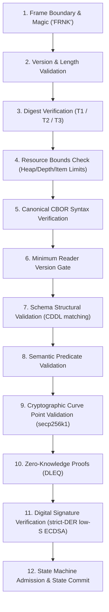

# Deterministic CBOR v1 (FRNK) Specification

**Status**: Normative Encoding and Validation Standard  
**Implementations**: `@frank/codec` (TypeScript), `frank-cbor` (Rust zero-copy parser)  
**Conformance Vectors**: `docs/protocol/cbor/vectors/`

---

## 1. Framing Architecture

Every independently stored, signed, hashed, or forwarded Frank object is serialized as an exact binary **frame**:

| Offset | Size | Field | Description |
| :---: | :---: | :--- | :--- |
| **0** | 4 bytes | Magic Bytes | ASCII `FRNK` (`0x46 0x52 0x4e 0x4b`) |
| **4** | 1 byte | Frame Version | Protocol frame version (`0x01`) |
| **5** | 4 bytes | Body Length | Big-endian uint32 payload length (bytes `9..N`) |
| **9** | $N$ bytes | CBOR Envelope | Canonical CBOR map `{ 0: type_id, 1: schema_version, 2: min_reader_version, 3: payload_bytes }` |

Worked example: a Type 17 text item `{0: "hi"}` (23 bytes total):

```text
46 52 4e 4b            FRNK (magic)
01                     frame version 1
00 00 00 0e            CBOR body length 14
a4                     envelope map, 4 entries
  00 11                  0: type_id = 17 (text-message-item)
  01 01                  1: schema_version = 1
  02 01                  2: min_reader_version = 1
  03 45                  3: payload = 5-byte string
     a1 00 62 68 69        payload map {0: "hi"}
```

---

## 2. Canonical Encoding Constraints (Strict CBOR)

To ensure byte-for-byte deterministic hashing across all languages (TypeScript, Rust, Go, Python):

1. **Integer Map Keys**: All protocol map keys MUST be unsigned integers (`uint`), serialized in strictly ascending numerical order without duplicates. Text or string keys are forbidden.
2. **Minimal Integer Representation**: Integers MUST use the shortest possible CBOR encoding (0–23 inline, 24–255 as 1-byte, 256–65535 as 2-byte, etc.).
3. **No Indefinite-Length Items**: Indefinite-length byte strings, text strings, arrays, or maps are strictly rejected.
4. **No Floating-Point Values**: IEEE 754 float types are disallowed in protocol records to prevent architecture-dependent precision loss.
5. **Exact UTF-8 String Encoding**: Text strings MUST be valid UTF-8, with no unassigned Unicode code points or invalid surrogate pairs.
6. **Zero Trailing Bytes**: The CBOR payload must consume exactly the remaining bytes of the frame. Trailing data is a fatal deserialization error.

---

## 3. Type ID Allocation Registry

| Type ID | Hex | Name | CDDL Schema Rule | Description |
| :---: | :---: | :--- | :--- | :--- |
| **1** | `0x0001` | Direct Message Delivery | `direct-message-delivery` | Outermost DKSAP message container with payment stamps |
| **2** | `0x0002` | Directory Attestation | `directory-attestation` | Wraps and signs a Type 4 directory statement with ECDSA |
| **3** | `0x0003` | Mailbox Checkpoint | `mailbox-checkpoint` | Relay mailbox sync and ordering checkpoint |
| **4** | `0x0004` | Directory Statement | `directory-statement` | Account-to-relay binding, public keys ($P, M, P'$), and revision |
| **5** | `0x0005` | Recipient Encrypted Payload | `recipient-encrypted-payload-v2` | XChaCha20-Poly1305 ciphertext with DLEQ proof |
| **6** | `0x0006` | Encrypted Message Content | `encrypted-message-content` | Inner decrypted container with logical message ID & conversation ID |
| **7** | `0x0007` | Key Transition Statement | `key-transition-statement` | Authorized cryptographic key migration proof |
| **8** | `0x0008` | Message Content Revision | `message-content-revision` | Ordered array of semantic message items |
| **9** | `0x0009` | Topic Post | `topic-post` | Public forum post published to an open topic |
| **10** | `0x000a` | Topic Post Submission | `topic-post-submission` | Client broadcast submission with burn stamp |
| **11** | `0x000b` | Topic Vote Submission | `topic-vote-submission` | On-chain upvote/downvote burn submission |
| **12** | `0x000c` | Forum View | `forum-view` | Paginated topic post query response |
| **13** | `0x000d` | Forum Topic Page | `forum-topic-page` | Paginated topic list response |
| **14** | `0x000e` | Forum Discovery Page | `forum-discovery-page` | Public topic registry discovery page |
| **15** | `0x000f` | Forum Operation Status | `forum-operation-status` | Execution status for forum operations |
| **16** | `0x0010` | Container Message Item | `container-message-item` | Recursive grouping container for message items |
| **17** | `0x0011` | Text Message Item | `text-message-item` | UTF-8 direct chat text message |
| **19** | `0x0013` | Stealth Payment Item | `stealth-message-item` | Single-use ephemeral DKSAP on-chain transfer notification |
| **24** | `0x0018` | Universal State Channel Update | `channel-update-item` | Interactive turns, atomic swaps, and multi-network balance updates |
| **25** | `0x0019` | Forwarding Delivery Envelope | `forwarding-delivery-envelope` | Store-and-forward relay hop delivery envelope (up to 32 MiB) |

---

## 4. Multi-Stage Validation Order

Implementations MUST process frames through twelve rigorous validation stages:


