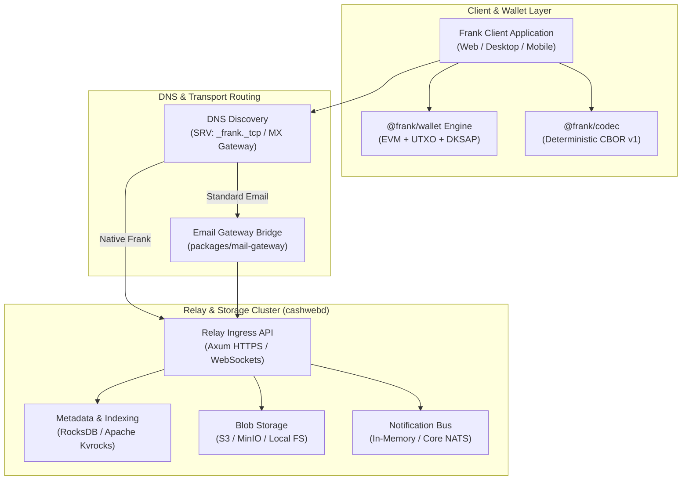

# Frank & Cashweb Developer Guide

**Welcome to Frank & Cashweb**: High-assurance, self-custodial, end-to-end encrypted direct messaging and autonomous financial coordination.

---

## 1. What is Frank?

Frank is an open protocol and decentralized communication system that combines:

1. **Self-Custodial Cryptographic Identity**: Every user is an autonomous cryptographic actor. Handles like `alice@domain.org` map to self-sovereign directory attestations signed by the user's root authority key.
2. **Dual-Key Stealth Address Protocol (DKSAP)**: Message envelopes and payment transactions leverage stealth address derivation on secp256k1, ensuring mathematical unlinkability between senders and recipients.
3. **Deterministic CBOR (FRNK v1)**: All wire payloads, directory statements, and topic records are encoded with canonical, deterministic CBOR with strict byte-level invariants and zero ambiguous floating-point or integer encodings.
4. **Dual-Protocol Routing (SRV + MX)**: A unified identifier (e.g. `alice@domain.com`) resolves to a high-speed Frank relay over DNS SRV and falls back to traditional SMTP email via standard MX records and an automated bidirectional mail gateway.
5. **Decoupled Clustered Relay Infrastructure**: Relays run either as zero-dependency standalone binaries using embedded RocksDB, or horizontally scaled clusters backed by Apache Kvrocks, Core NATS, and S3-compatible blob stores.
6. **Ambient Privacy & Graph Entropy**: Rather than forcing users into conspicuous mixer pools (e.g. Tornado Cash) which attract regulatory blacklisting and negative taint, Frank's automated UTXO/EVM wallet mixing operates through standard peer-to-peer gas transfers. This creates positive privacy externalities ("herd privacy") across the entire blockchain.

---

## 2. Core Architecture Overview



---

## 3. The Three Independent Wallet Roles

To guarantee that compromising an active messaging session or viewing public transaction records never compromises the root identity, Frank wallets derive three strictly separated cryptographic roles:

|   Role   |          Name          | Purpose                                                                                                                                            | Derivation Path        |
| :------: | :--------------------: | :------------------------------------------------------------------------------------------------------------------------------------------------- | :--------------------- |
| **$P$**  | **Identity Authority** | Signs public directory assertions, key transitions, and account credentials. **Never** used for ECDH, message encryption, or funding transactions. | `m/44'/60'/1'/0/0`     |
| **$M$**  |  **Mailbox & DM Key**  | Performs Diffie-Hellman key exchange for direct-message encryption and authenticates inbox access.                                                 | `m/44'/60'/4'/0'/{g}'` |
| **$P'$** | **Stamp Receipt Key**  | Serves as the public base point for recipient-controlled stealth payment addresses.                                                                | `m/44'/60'/2'/0'/{g}'` |

---

## 4. Repository Structure

The Frank monorepo is organized into specialized TypeScript packages and high-performance Rust daemons:

```
frank/
├── backend/
│   └── cashweb/
│       ├── cashwebd/         # Production Rust relay server daemon
│       ├── frank-cbor/       # Zero-copy Rust deterministic CBOR parser
│       └── cashweb-registry/ # Directory & chain registry storage
├── packages/
│   ├── frank-codec/          # TypeScript reference CBOR encoder/decoder
│   ├── cashweb/              # Client SDK for relays and direct messaging
│   ├── wallet/               # Unified EVM + UTXO wallet and DKSAP engine
│   ├── crypto-box/           # AEAD encryption, ECDH, and key encapsulation
│   ├── mail-gateway/         # SMTP/MIME to Frank bidirectional bridge
│   ├── bitcore-lib-xpi/      # Lotus and UTXO cryptographic primitives
│   └── docs/                 # VitePress documentation portal
└── docs/                     # Formal protocol specifications and CDDL schemas
```

---

## 5. Quick Start & Development

### Prerequisites

- Node.js >= 20 (recommended: Node 22+)
- Yarn v1.22.x
- Rust toolchain (stable `cargo` and `rustc`)

### Install Dependencies

```bash
yarn install
```

### Run Type Checking

```bash
yarn typecheck:fast
```

### Run Protocol Tests

```bash
# TypeScript CBOR codec tests
yarn workspace @frank/codec test

# Rust zero-copy CBOR parser tests
cargo test --manifest-path backend/cashweb/frank-cbor/Cargo.toml
```

### Launch Documentation Portal Locally

```bash
yarn docs:dev
```

Open `http://localhost:5173` in your browser.
