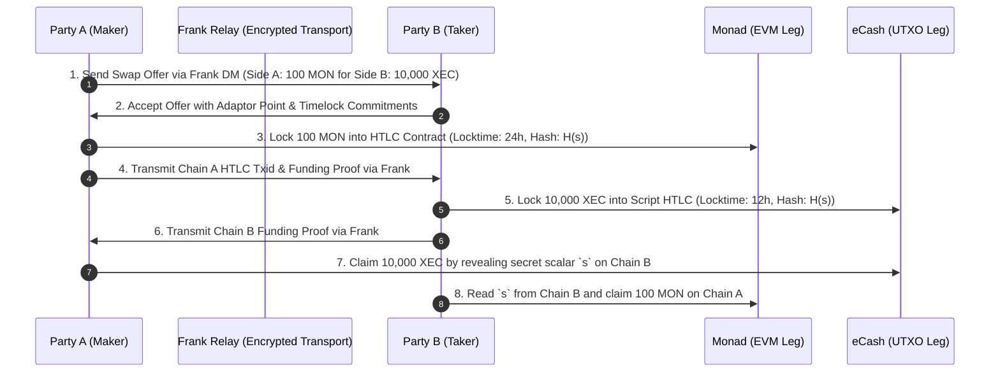

# Cross-Chain Atomic Swaps Specification

**Status**: Research & Design Specification (Testnet-Only)  
**Implementation**: `packages/swap-protocol`, `packages/adaptor-signatures`  
**Primary Specification**: `docs/atomic-swap-specification.md`

---

## 1. Overview & Goals

Frank provides a decentralized, peer-to-peer atomic swap protocol enabling cryptographic asset exchange across disjoint blockchain ecosystems without centralized intermediaries, custodian smart contracts, or bridge exploits.

The protocol couples state changes across three heterogeneous chain families:

1. **EVM Account Chains**: Monad, Ethereum, Polygon
2. **UTXO Chains**: eCash (XEC), Bitcoin Cash (BCH), Lotus (XPI)
3. **Account/Signature Chains**: Solana (Ed25519)

---

## 2. Core Protocol Mechanics

Swaps use Frank's end-to-end encrypted messaging channels for private negotiation and state machine transitions, while native on-chain smart contracts or script hash locks enforce unilateral settlement:

---

## 3. Cryptographic Invariants & Safety Rules

1. **Staggered Timelocks**: $T_A > T_B$ (e.g. 24h vs. 12h) ensures that Party A cannot wait out Party B's timeout while simultaneously claiming Party B's funds.
2. **Zero Custody by Relays**: Relays act solely as oblivious, encrypted message couriers. Relays never possess swap preimages, cannot execute transactions, and have no authority over chain state.
3. **Unilateral Recovery**: If either party disconnects or halts after funding, the non-faulty party can unilaterally reclaim their deposit once the respective timelock expires.
