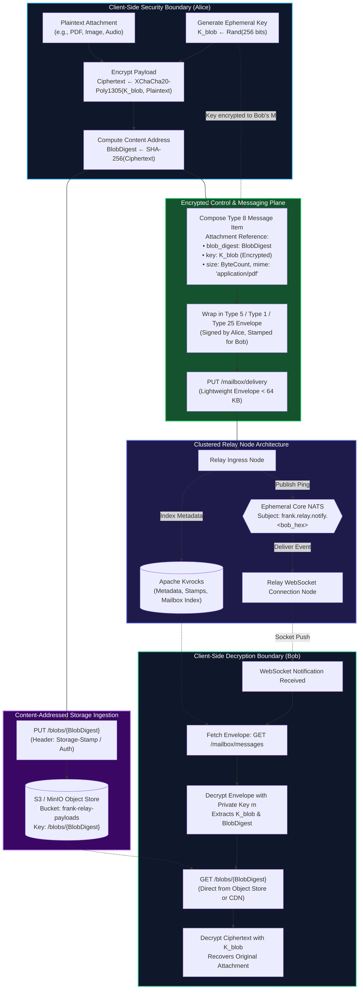

# Content-Addressed Encrypted Blob Storage & Attachments

- **Status**: Standard (Track C, Issue #983, Commit `e38d9cf6`)
- **Scope**: Large payload (> 64 KB) offloading to S3-compatible object storage, Apache Kvrocks metadata indexing, ephemeral Core NATS fan-out, and end-to-end client decryption.

---

## 1. Architectural Motivation

In high-throughput federated messaging, embedding large files (images, audio notes, PDF documents) directly inside RocksDB write-ahead logs (WAL) causes write amplification, LSM compaction freezes, and database bloat.

Frank decouples control plane metadata from data plane payloads:

- **Control Plane**: Envelopes $\le 64\text{ KB}$ (metadata, DKSAP stamps, Chaum-Pedersen DLEQ proofs, expiration timestamps) are stored in **Apache Kvrocks** (or RocksDB in standalone mode).
- **Data Plane**: Encrypted file attachments and payloads $> 64\text{ KB}$ are streamed directly to **S3-compatible Object Storage** (MinIO, Cloudflare R2, AWS S3) addressed purely by cryptographic hash.
- **Event Plane**: Ephemeral **Core NATS** notifies connected nodes without storing persistent message copies.

---

## 2. End-to-End Cryptographic & Data Architecture

---

## 3. Cryptographic Invariants

1. **Zero Cleartext on Relays**: The blob storage provider never stores plaintext files. All data is encrypted client-side with an ephemeral 256-bit symmetric key $K_{\text{blob}}$ using XChaCha20-Poly1305 before transmission.
2. **Key Transport Security**: The symmetric key $K_{\text{blob}}$ is encapsulated within the end-to-end encrypted Type 5 payload, sealed with the recipient's authenticated Diffie-Hellman key $M$. Only the intended recipient can recover $K_{\text{blob}}$.
3. **Immutability & Content Verification**: The object identifier in storage is strictly equal to the SHA-256 (or BLAKE3) digest of the ciphertext. Recipients verify that the downloaded ciphertext matches the digest in the signed envelope before decryption.
