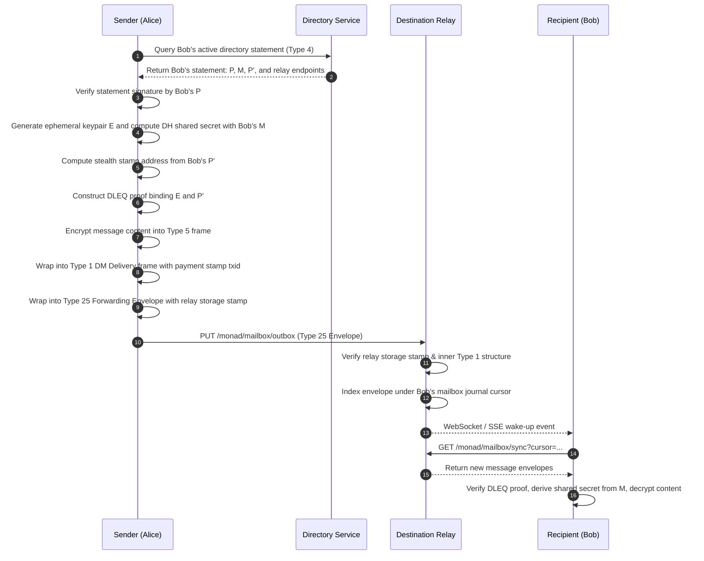

# Cashweb Protocol Specification Overview

**Status**: Normative Human Semantics and Protocol Index  
**Primary Specification**: `docs/CASHWEB-PROTOCOL-SPEC.md`

---

## 1. Status Vocabulary & Hierarchy

The Cashweb protocol governs direct messaging, directory attestation, storage payments, and relay federation. Normative requirements use RFC 2119 keywords under four explicit statuses:

- **SHIPPED**: Reachable through normal in-repository runtime paths.
- **IMPLEMENTED-NOT-WIRED**: Code and tests exist, but default clients do not yet use the path.
- **PROPOSED**: Accepted target semantics; implementation and cutover remain scheduled.
- **UNALLOCATED**: A namespace or wire identifier has deliberately not been assigned.

---

## 2. Cryptographic Role Separation

To eliminate cross-domain key compromise, wallets derive three strictly disjoint secp256k1 roles:

1. **$P$ (Directory Authority Key)**:
   - Signs directory statements and key transitions.
   - Never used for ECDH key agreement, mailbox authentication, or funding transactions.
2. **$M$ (Mailbox & Messaging DH Key)**:
   - Authenticates mailbox access (`POST /message/monad/auth/:recipient`).
   - Participates in Diffie-Hellman shared secret derivation for direct-message encryption.
3. **$P'$ (Stamp Receipt Base Key)**:
   - Serves as the public base point for recipient-controlled stealth payment addresses ($P'_i$).
   - Never signs directory assertions or performs message decryption.

---

## 3. Direct Message Delivery Lifecycle

---

## 4. Single-Break Clean Cutover

Frank is executing a single-break transition from legacy Protobuf/JSON formats to Deterministic CBOR v1 (FRNK). Legacy formats are isolated in read-only compatibility shims and will be decommissioned upon completion of the cutover.
