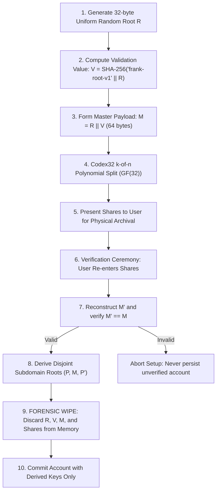

# Codex32 Paper Backup & Recovery Specification

**Status**: Design Specification  
**Implementation**: `packages/codex32`, `packages/account-recovery`, `packages/account-vault`  
**Primary Specification**: `docs/codex32-signup-and-backup-specification.md`

---

## 1. Executive Summary

Frank uses **Codex32** (BIP-93) to provide checksummed, threshold-recoverable paper backups for self-custodial accounts.

Unlike legacy BIP-39 mnemonics—which lack error detection, error correction, and native threshold splitting—Codex32 allows users to create $k$-of-$n$ shares (e.g. 2-of-3 or 3-of-5) encoded with the human-friendly Bech32 character set.

---

## 2. Master Secret & Verification Lifecycle

---

## 3. Key Design Invariants

1. **Zero Master Secret Retention**: Once domain keys ($P, M, P'$) are derived and verified during initial signup, raw root $R$ and master $M$ are completely purged from application memory. Frank never persists the root to local storage.
2. **Mandatory Pre-Commit Verification**: A new account cannot be finalized or funded until the user demonstrates the ability to restore $M$ by successfully entering their physical shares.
3. **No BIP-39 Conversion**: Frank does not convert BIP-39 mnemonics into Codex32 shares, preserving strict cryptographic hygiene and avoiding weak entropy sources.
