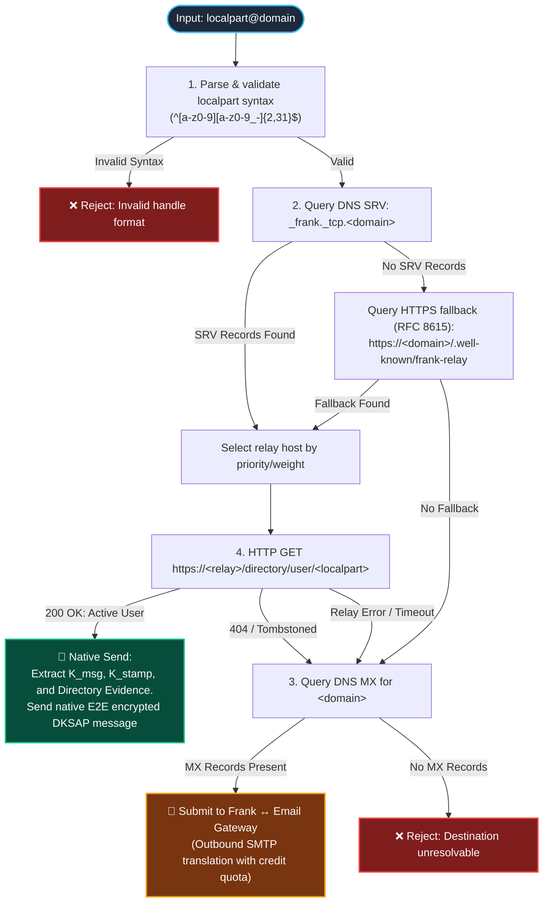
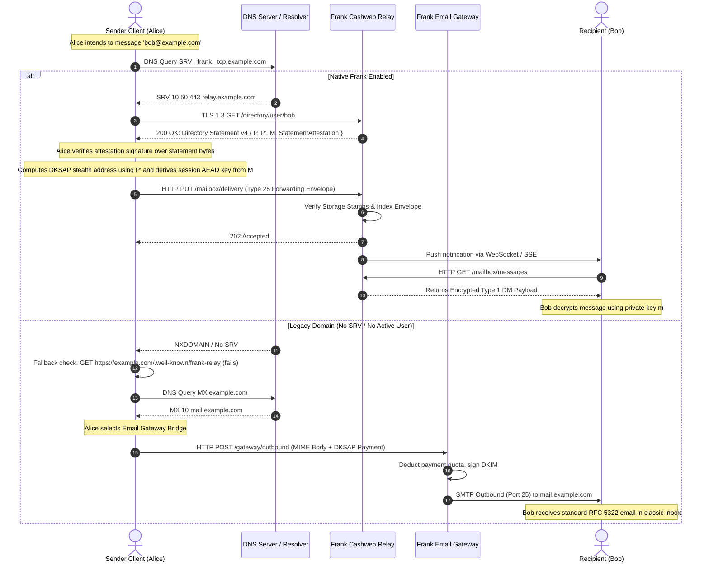

# Frank Dual-Protocol Domain DNS Routing Specification (SRV + MX)

- **Status**: Standard Draft (Parent Epic #821, Issue #973, Commit `21ef1bea`)
- **Scope**: DNS standards and client resolution algorithms enabling `user@domain` handles to function simultaneously as native Frank cryptographic direct-message endpoints and standard RFC 5321/5322 email addresses.

---

## 1. Overview & Architectural Objective

Frank provides self-custodial, end-to-end encrypted messaging with Dual-Key Stealth Address Protocol (DKSAP) financial payments. In traditional communication networks, users must manage disparate identifiers: public cryptographic keys, telephone numbers, and email addresses.

This specification establishes DNS record conventions and client resolution procedures allowing any registered Internet domain (e.g., `alice@example.com`) to serve as:

1. **A Native Frank Direct Messaging Handle**: Resolving transparently to a federated Cashweb relay endpoint, retrieving the recipient's authenticated Diffie-Hellman encryption public key ($K_{\text{msg}}$), stamp payment key ($K_{\text{stamp}}$), and directory evidence.
2. **A Standard Internet Email Address**: Routing traditional SMTP mail delivery through MX records to an automated Frank Email Gateway daemon that translates inbound emails into privacy-preserving DKSAP direct messages.

---

## 2. Client Resolution Algorithm

When a Frank client or daemon is instructed to communicate with an identifier matching `localpart@domain`:

---

## 3. Handshake & Resolution Sequence

---

## 4. Cryptographic & Operational Invariants

1. **DNS is Discovery Only, Never Authority**: DNS SRV and MX records provide network routing locations only. All cryptographic authority derives strictly from the user's self-custodial root statement attestation.
2. **DNSSEC Strongly Recommended**: Relay discovery queries SHOULD be executed with DNSSEC validation enabled to prevent man-in-the-middle redirection to rogue relay endpoints.
3. **Strict TLS Enforcement**: Frank clients MUST reject plaintext HTTP connections. All relay communication MUST use TLS 1.3 on port 443 with valid X.509 server certificates matching the SRV target FQDN.
4. **Content-Oblivious Relay Boundary**: Relays process encrypted envelopes without access to message text. Resolution of `user@domain` happens exclusively at envelope creation; inner Type 6 encrypted payloads remain end-to-end encrypted to $K_{\text{msg}}$.
