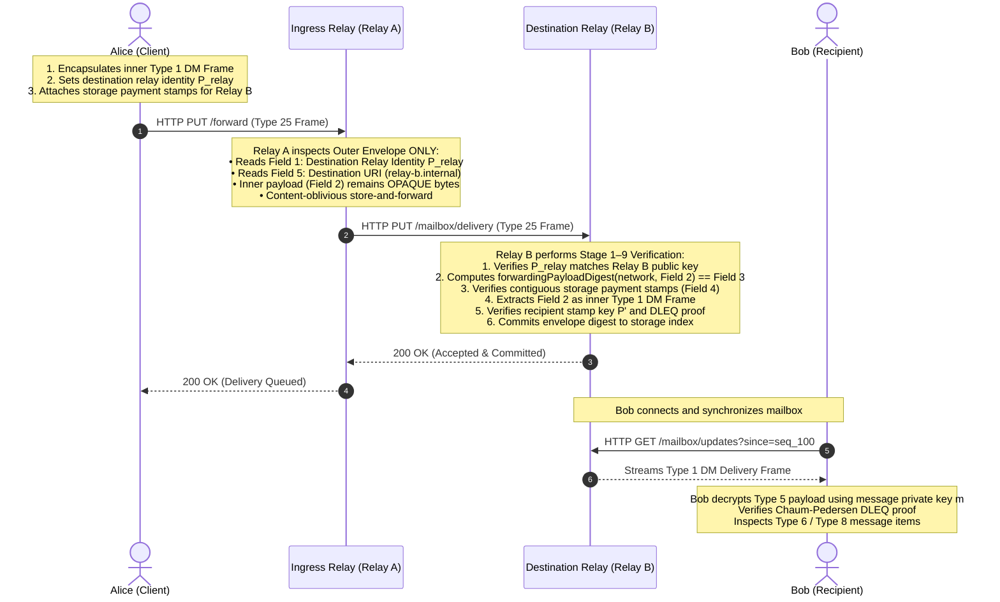

# Store-and-Forward Forwarding Delivery Envelope (Type 25)

- **Status**: Standard (Track C, Issue #986, PR #996, Commit `fc3fcb5a`)
- **Implementations**:
  - CDDL Schema: `docs/protocol/cbor/direct-message.cddl`
  - TypeScript: `packages/frank-codec/src/forwarding.ts`
  - Rust: `backend/cashweb/frank-cbor/src/forwarding.rs`

---

## 1. Overview & Architectural Objective

The **Type 25 Forwarding Delivery Envelope** provides hop-by-hop store-and-forward relaying across federated Cashweb nodes. It enforces a strict **Content-Oblivious Boundary**: intermediary and destination relays verify storage stamps, delivery TTLs, and routing identities without inspecting or decrypting the encapsulated message payload.

---

## 2. CDDL Wire Specification

From `docs/protocol/cbor/direct-message.cddl`:

```cddl
; Active type 25 / schema 1 / min-reader 1: relay forwarding delivery envelope.
forwarding-delivery-envelope = {
  0: network-tag,                       ; destination relay network, e.g. "monad-testnet"
  1: account-ref,                       ; destination relay routing identity (key type 1)
  2: framed-object,                     ; inner direct-message-delivery (Type 1) frame
  3: digest-32,                         ; forwarding payload digest of field 2
  4: [1*64 payment-member],             ; storage payment stamps compensating destination relay
  ? 5: tstr .size (1..256),             ; optional destination relay endpoint URI
  ? 6: uint .le 4294967295,             ; optional delivery TTL / expiration timestamp (seconds)
  * uint => frank-value,                ; additive extensible fields
}
```

---

## 3. Nested Multi-Layer Encapsulation

Frank achieves defense-in-depth through concentric deterministic CBOR frames:

```
┌────────────────────────────────────────────────────────────────────────────────────────┐
│ 1. TYPE 25: FORWARDING DELIVERY ENVELOPE (Hop-by-Hop Relay Envelope)                  │
│    • Network Tag (Field 0)                                                             │
│    • Destination Relay Identity P_relay (Field 1, Key Type 1, 33-byte secp256k1)       │
│    • Forwarding Payload Digest T_fwd (Field 3, 32-byte SHA-256)                        │
│    • Storage Payment Stamps (Field 4, [1*64 payment-member] with contiguous indices)   │
│    • Optional Endpoint URI & TTL Timestamp (Fields 5, 6)                              │
│ ┌────────────────────────────────────────────────────────────────────────────────────┐ │
│ │ 2. TYPE 1: DIRECT MESSAGE DELIVERY (Destination Relay Delivery Frame)              │ │
│ │    • Network Tag (Field 0)                                                         │ │
│ │    • Recipient Stamp Key P' (Field 1, Key Type 1)                                  │ │
│ │    • Frame Digest T3 of Field 2 (Field 3)                                          │ │
│ │    • Recipient Storage Payment Stamps (Field 4)                                    │ │
│ │ ┌────────────────────────────────────────────────────────────────────────────────┐ │ │
│ │ │ 3. TYPE 5: RECIPIENT ENCRYPTED PAYLOAD (XChaCha20-Poly1305 Crypto-Box v2)      │ │ │
│ │ │    • Routing Sender & Recipient Identities (Fields 1, 2)                       │ │ │
│ │ │    • Ephemeral Stamp Point E (Field 5, 33 bytes)                               │ │ │
│ │ │    • Ephemeral Stamp Point X (Field 6, 33 bytes)                               │ │ │
│ │ │    • Chaum-Pedersen DLEQ Proof c || s (Field 7, 64 bytes)                      │ │ │
│ │ │    • Ciphertext (Field 4, AEAD authenticated with dm-crypto-context-v1)        │ │ │
│ │ │ ┌────────────────────────────────────────────────────────────────────────────┐ │ │ │
│ │ │ │ 4. TYPE 6: DECRYPTED MESSAGE CONTENT (End-to-End Plaintext Context)        │ │ │ │
│ │ │ │    • Stable Logical Message ID (UUID-16, Field 1)                          │ │ │ │
│ │ │ │    • Content Digest T1a of Field 2 (Field 3)                               │ │ │ │
│ │ │ │    • Conversation ID (UUID-16, Field 4) & Optional Name                    │ │ │ │
│ │ │ │ ┌────────────────────────────────────────────────────────────────────────┐ │ │ │ │
│ │ │ │ │ 5. TYPE 8: MESSAGE CONTENT REVISION                                    │ │ │ │ │
│ │ │ │ │    • Transcript Network Domain: "frank" (Field 0)                      │ │ │ │ │
│ │ │ │ │    • Ordered Semantic Message-Item Frames (Field 1, [1*256])           │ │ │ │ │
│ │ │ │ │ ┌────────────────────────────────────────────────────────────────────┐ │ │ │ │ │
│ │ │ │ │ │ 6. SEMANTIC ITEMS:                                                 │ │ │ │ │ │
│ │ │ │ │ │    • Type 17: UTF-8 Text Item                                      │ │ │ │ │ │
│ │ │ │ │ │    • Type 18: Blackjack Move / P2P Hand                            │ │ │ │ │ │
│ │ │ │ │ │    • Type 19: Stealth Payment Item                                 │ │ │ │ │ │
│ │ │ │ │ │    • Type 24: Universal State Channel Update                       │ │ │ │ │ │
│ │ │ │ │ └────────────────────────────────────────────────────────────────────┘ │ │ │ │ │
│ │ │ │ └────────────────────────────────────────────────────────────────────────┘ │ │ │ │
│ │ │ └────────────────────────────────────────────────────────────────────────────┘ │ │ │
│ │ └────────────────────────────────────────────────────────────────────────────────┘ │ │
│ └────────────────────────────────────────────────────────────────────────────────────┘ │
└────────────────────────────────────────────────────────────────────────────────────────┘
```

---

## 4. Relay Store-and-Forward Sequence



---

## 5. Implementation Invariants

1. **Storage Stamp Ordering**: Payment members in Field 4 MUST have strictly ascending, contiguous child indices $i \in [0, N-1]$ without gaps or duplicate UTXO vout values.
2. **Deterministic Payload Digest**: Field 3 MUST equal `forwardingPayloadDigest(network, payloadFrame)`.
3. **Fail-Closed Relay Policy**: If destination relay connectivity or KV coordination is lost, the relay fails closed (returning `HTTP 503 Service Unavailable`), preventing dropped messages or lost storage stamps.
