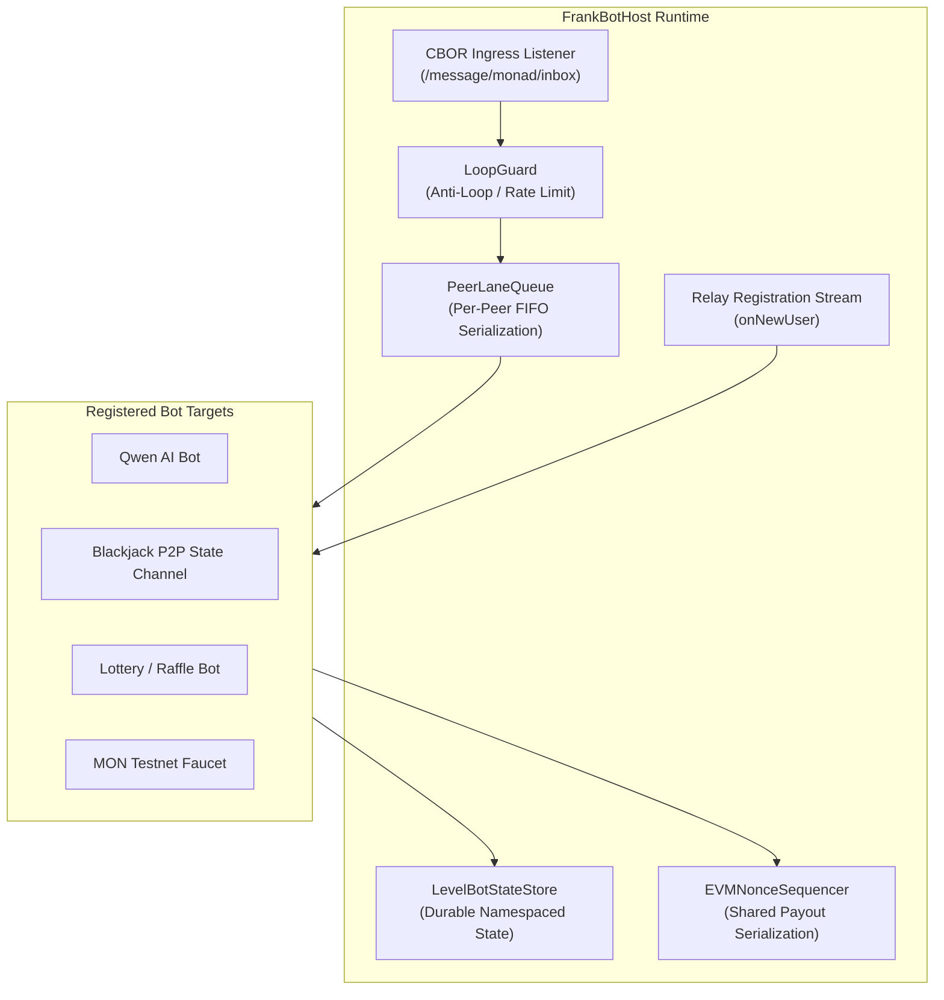

# Frank Bot Framework & SDK

**Unified Framework for Headless Bots, Concurrency & Autonomous Agents**  
**Package Paths**: `packages/bot-framework`, `packages/bot`  
**License**: MIT  
**Runtime**: Node.js >= 20 / TypeScript

---

## 1. Overview

`@frank/bot-framework` provides a battle-tested foundation for building autonomous, headless Frank bots on Monad testnet and mainnet.

Running automated services over Frank requires solving complex challenges:
- **Canonical Open Directory**: Automated generation, signing, and renewal of Revision Zero and Next Revision directory attestations via `@frank/directory-admission` to prevent `"Not Found: This address has not published itself yet"`.
- **EVM Nonce Collisions**: Multiple bots sharing a funding account or hot wallet on Monad can trigger out-of-order nonce rejections during rapid payouts.
- **Relay Ingress Protocol**: Handling raw CBOR envelopes over `/message/monad/cbor` and `/message/monad/inbox`.
- **Concurrency & Re-entrancy**: Game rounds (Blackjack, Dice, Rock-Paper-Scissors) require strict per-peer FIFO processing to eliminate race conditions and exploit attempts.

`@frank/bot-framework` abstracts these low-level concerns into a clean, declarative interface (`FrankBotDefinition`).

---

## 2. Core Architecture



---

## 3. Key Framework Primitives

### 1. Canonical Open Directory Automation
Bots automatically sign their identity authority statements and schedule heartbeat renewals prior to `binding_expiry_ns`. This ensures Frank client address books always recognize the bot as verified and active.

### 2. `LoopGuard`
Prevents cascading bot-to-bot reply loops, blocks denylisted peers, enforces configurable per-peer reply rate limits, and automatically ignores self-echo frames.

### 3. `PeerLaneQueue`
Serializes message processing per peer so concurrent moves/messages for the same user execute in strict FIFO order without race conditions, while allowing different peers to be served concurrently in parallel lanes.

### 4. `EVMNonceSequencer`
Coordinates on-chain Monad transactions (such as faucet disbursements, raffle payouts, or vendor payments) across multiple concurrently executing bots sharing a bankroll wallet, guaranteeing sequential EVM nonce assignment without dropped transactions.

### 5. `LevelBotStateStore`
Embedded, durable state storage backed by LevelDB with automatic sublevel namespacing per bot.

---

## 4. Built-in Bot Targets (`@frank/bot`)

The repository includes complete production bot implementations ready for one-command execution:

| Target | Command | Purpose |
| :--- | :--- | :--- |
| **Qwen AI** | `yarn --cwd packages/bot target:qwen` | Conversational LLM assistant paying real MON stamps to respond |
| **Blackjack P2P** | `yarn --cwd packages/bot target:blackjack` | Interactive Universal State Channel (Type 24) card game dealer |
| **Raffle** | `yarn --cwd packages/bot target:raffle` | Provably fair on-chain lottery with automatic winner payouts & refunds |
| **Faucet** | `yarn --cwd packages/bot target:faucet` | Rate-limited Monad testnet token faucet for onboarding users |
| **Vendor** | `yarn --cwd packages/bot target:vendor` | Autonomous digital good vendor with on-chain payment verification |
| **Lobby** | `yarn --cwd packages/bot target:lobby` | Matchmaking and game discovery lobby |
| **All Bots** | `yarn --cwd packages/bot target:all` | Runs all bots concurrently inside a single hosted process |

---

## 5. Implementing a Custom Bot

```typescript
import type {
  FrankBotDefinition,
  BotMessageContext,
  BotProfile,
  NewUserEvent,
  BotContext,
} from "@frank/bot-framework";

export class WelcomeBot implements FrankBotDefinition {
  readonly id = "welcome-bot";
  readonly label = "Community Greeter";
  readonly defaultIdentityPath = "~/.frank/welcome-bot-identity.json";

  getProfile(): BotProfile {
    return {
      name: "Welcome Bot",
      bio: "Official greeter for the Frank network",
      avatar: "https://example.com/avatar.png",
      bot: true,
    };
  }

  // Proactive greeting when a user registers on the relay
  async onNewUser(user: NewUserEvent, ctx: BotContext): Promise<void> {
    await ctx.sendDirectMessage(user.address, [
      { type: "text", text: `Welcome to Frank, ${user.displayAddress}! Type !help for commands.` },
    ]);
  }

  // Handle incoming direct messages
  async onMessage(ctx: BotMessageContext): Promise<void> {
    const text = ctx.items.find((i) => i.type === "text")?.text?.trim();

    if (text === "!help") {
      await ctx.reply([
        { type: "text", text: "Available commands:\n• !ping - Health check\n• !faucet - Request test MON" },
      ]);
      return;
    }

    if (text === "!ping") {
      await ctx.reply([{ type: "text", text: "pong 🏓" }]);
      return;
    }
  }
}
```

---

## 6. One-Command Full Demo Stack

You can launch the entire stack (relays, bots, and simulated chain) with:

```bash
# Offline demo with local fake Monad RPC (zero funds/network required)
yarn demo --fake-chain

# Live demo against Monad testnet
yarn demo
```
