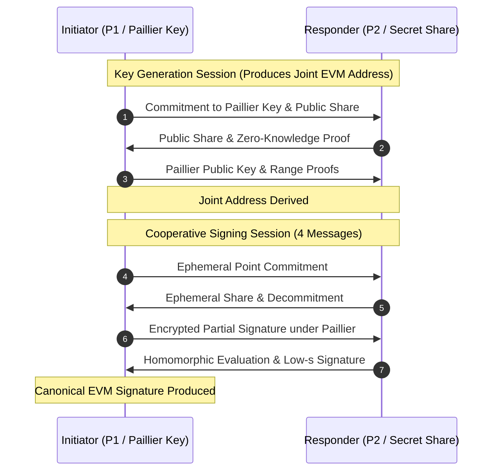

# @frank/threshold-ecdsa

**Two-Party Threshold ECDSA & Adaptor Signatures over secp256k1**  
**Package Path**: `packages/threshold-ecdsa`  
**License**: MIT  
**Dependencies**: `@frank/adaptor-signatures`, `@noble/curves`, `@noble/hashes`  
**Status**: Experimental / Testnet-Only (Not externally audited)

---

## 1. Overview

`@frank/threshold-ecdsa` implements **Two-Party (2-of-2) Threshold ECDSA** over secp256k1 based on Yehuda Lindell's seminal paper, *"Fast Secure Two-Party ECDSA Signing"* (CRYPTO 2017, ePrint 2017/552).

It allows two independent parties to jointly control a single canonical EVM address:
- **No Single Key Exists**: Each party holds an individual secret share. Neither party ever sees the full private key.
- **Cooperative Signing**: Neither party can sign transactions unilaterally. Signing requires a 4-message exchange between Initiator ($P_1$) and Responder ($P_2$).
- **Standard EVM Output**: The final output is an ordinary, canonical low-$s$ ECDSA signature (with standard recovery bit `v`) indistinguishable on-chain from a standard single-key wallet.
- **Two-Party Adaptor Pre-Signing**: Supports encrypted pre-signatures bound to responder discrete-log commitments, allowing off-chain state channel disputes and atomic reveal mechanics.

---

## 2. Attack Mitigations & Cryptographic Hardening

The package includes explicit defenses against historical vulnerabilities in threshold ECDSA schemes:

| Vulnerability / Attack Vector | Mitigation in `@frank/threshold-ecdsa` |
| :--- | :--- |
| **BitForge (2023) Paillier Checks** | Validates 2048-bit odd modulus with no small prime factor below 6370, verifies $\gcd(N, \phi(N)) = 1$, and enforces interactive cut-and-choose range proofs. |
| **TSSHOCK (2023) Weak Fiat-Shamir** | Length-prefixed transcript hashing bound to session IDs, participant public identities, and provers. Modulus proofs use 11 repetitions ($\text{error} < 2^{-128}$). |
| **Lindell17 Abort Attack (CVE-2023-33242)** | If an invalid ciphertext is received during decryption, the key share is immediately and permanently burned (`keyShareBurned`). All secrets are wiped from memory to prevent bit-by-bit scalar extraction. |
| **Non-Malleable Tweaks** | Addresses can be homomorphically tweaked by a 32-byte scalar commitment (e.g. game state or channel hash) without re-running key generation. |

---

## 3. Protocol Flow



---

## 4. Usage Example

```typescript
import {
  generateThresholdKeyP1,
  generateThresholdKeyP2,
  startSigningSessionP1,
  respondSigningSessionP2,
} from "@frank/threshold-ecdsa";

// 1. Key Generation between two parties
const p1Keygen = await generateThresholdKeyP1();
const p2Keygen = await generateThresholdKeyP2(p1Keygen.messageToP2);

// Joint EVM address
console.log("Joint Address:", p1Keygen.jointAddress);

// 2. Cooperative Signing
const sighash = new Uint8Array(32); // 32-byte transaction digest
const p1Session = startSigningSessionP1(p1Keygen.share, sighash);

const p2Response = respondSigningSessionP2(
  p2Keygen.share,
  sighash,
  p1Session.messageToP2
);

const signature = p1Session.finish(p2Response.messageToP1);
console.log("Canonical EVM Signature:", signature.toHex());
```
